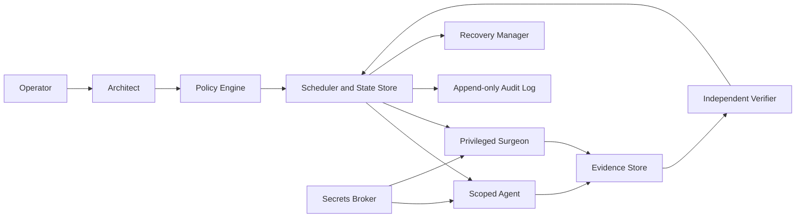

# GodBrain Agent Factory Blueprint

GodBrain's Agent Factory is a capability-based orchestration system for assigning
bounded work to specialized agents. It is not a self-replicating process, and an
LLM prompt is never treated as an authorization boundary.

The control plane decides what may run. Agents propose and execute work within
explicit grants. Every side effect produces evidence and is independently
verified before a job is considered complete.

## Design principles

1. **Deny by default.** An agent receives only the tools, paths, endpoints, time,
   and credentials required for one job.
2. **Policy is deterministic.** Reasoning explains intent, but a policy engine,
   not an LLM, decides whether an action is authorized.
3. **Planning and execution are separate.** The Architect cannot directly mutate
   the host. Privileged changes go through the Surgeon.
4. **Verification is independent.** The agent that performs a change cannot be
   the only component that declares it successful.
5. **External content is untrusted.** Web pages, model output, graph records, and
   retrieved documents are data, never instructions.
6. **Memory preserves provenance.** Derived summaries never replace their raw,
   immutable source records.
7. **Failure is explicit.** Timeouts, partial writes, missing evidence, and failed
   cleanup transition a job to a failed or rollback state, never success.
8. **High-risk domains are isolated.** OS administration, build automation, and
   financial execution use separate credentials and trust boundaries.

## Control-plane architecture



### 1. The Architect

**Purpose:** Planning and dependency decomposition.

**Responsibilities:**

- Convert an operator goal into a dependency graph of typed jobs.
- Select the least-privileged agent for each job.
- Declare expected outputs, verification criteria, risk class, and rollback
  requirements.
- Submit plans to the Policy Engine.

**Restrictions:**

- No direct shell, registry, service-control, wallet, or database-write access.
- Cannot approve its own high-risk plan.
- Cannot expand a capability grant after a job starts.

### 2. The Policy Engine

**Purpose:** Deterministic authorization.

**Responsibilities:**

- Validate each job against machine-readable policy.
- Reject unknown tools, paths, hosts, command families, or credential scopes.
- Enforce approval requirements by risk class.
- Mint a short-lived capability grant bound to one job and one agent.

Policy decisions must be reproducible without consulting an LLM.

### 3. The Scheduler and State Store

**Purpose:** Durable orchestration.

**Responsibilities:**

- Persist the job graph, leases, attempts, deadlines, and evidence references.
- Dispatch only jobs whose dependencies and approvals are satisfied.
- Enforce concurrency, resource budgets, retries, and idempotency.
- Recover abandoned leases after a worker crash.
- Prevent two agents from changing the same protected resource concurrently.

The scheduler owns job state. Agents cannot mark themselves complete directly.

### 4. The Secrets Broker

**Purpose:** Scoped credential delivery.

**Responsibilities:**

- Issue short-lived credentials for one job and resource.
- Keep credentials out of prompts, graph memory, logs, and result envelopes.
- Revoke credentials when a lease expires or a job finishes.
- Maintain separate credential domains for host administration, databases,
  source control, external APIs, and financial systems.

### 5. The Verifier

**Purpose:** Independent correctness and safety evaluation.

**Responsibilities:**

- Compare results against the job's acceptance criteria.
- Re-run targeted tests or read-only inspections.
- Confirm that rollback material and audit evidence exist.
- Detect unrelated changes, silent failures, and success-shaped fallbacks.
- Approve completion or request rollback/rework.

The Verifier has read access and test capabilities, but no production mutation
credentials.

### 6. The Recovery Manager

**Purpose:** Restore a known-good state.

**Responsibilities:**

- Store pre-change snapshots, registry exports, service configuration, artifact
  hashes, and database transaction references.
- Execute an approved rollback plan when verification fails.
- Verify the rollback independently.
- Escalate when a change cannot be reversed automatically.

## Specialized agents

### 7. The Surgeon

**Purpose:** The only general privileged OS executor.

**Responsibilities:**

- Apply approved PowerShell, registry, service, firewall, and filesystem changes.
- Capture before/after state and exact exit status.
- Execute dry-run and rollback phases when defined.
- Stop immediately if the capability grant, preconditions, or target state do
  not match the approved job.

**Required controls:**

- Valid short-lived capability grant.
- Non-empty reasoning and rollback plan.
- Explicit operator approval for high-risk changes.
- Command and resource allowlists.
- Exclusive lease on protected resources.

`wsudo` grants elevated user-mode privileges; it is not Ring 0.

### 8. The Watcher

**Purpose:** Security and OSINT ingestion.

**Responsibilities:**

- Ingest curated sources such as NVD/NIST, CISA KEV, vendor advisories, and
  GitHub Security Advisories.
- Record source URL, retrieval time, content hash, signature status, and trust
  tier.
- Correlate advisories with local software inventory.
- Produce candidate findings for verification, never direct remediation jobs.

Watcher workers have no Surgeon or database-administration credentials.

### 9. The Librarian

**Purpose:** Provenance-preserving memory management.

**Responsibilities:**

- Store raw records as immutable source nodes.
- Create versioned summaries, concepts, embeddings, and deduplication links.
- Retain links from every derived record to all source records.
- Track model, prompt/version, timestamp, confidence, and content hash.
- Mark superseded records without deleting their history.

The Librarian writes through the Go Memory Engine's validated schema. It does not
receive unrestricted database administration access.

### 10. The Forge

**Purpose:** Reproducible C/CUDA optimization.

**Responsibilities:**

- Profile the canonical Colibri source and record a baseline.
- Build in an isolated, reproducible environment.
- Compare correctness, memory use, throughput, and latency against the baseline.
- Sign produced artifacts and emit build provenance.
- Promote through a canary stage before replacing an active engine.

Forge cannot deploy an artifact that the Verifier has not accepted, and it
cannot modify the Policy Engine or its own acceptance thresholds.

### 11. The Interceptor

**Purpose:** Network and telemetry observation.

**Responsibilities:**

- Observe TCP/UDP connections and approved ETW providers.
- Attribute events to process, binary hash, destination, and time.
- Build an evidence package for suspicious activity.
- Propose a narrowly scoped firewall or DNS rule.

The Interceptor is read-only. Only the Surgeon may apply the proposed rule after
policy validation and approval.

### 12. The Oracle

**Purpose:** Market analysis in an isolated financial trust domain.

**Responsibilities:**

- Ingest authenticated market, weather, and news feeds.
- Model fees, liquidity, slippage, settlement rules, latency, and counterparty
  risk.
- Produce opportunities with confidence intervals and maximum-loss estimates.

**Isolation requirements:**

- Separate process, database namespace, audit log, and Secrets Broker policy.
- Dedicated low-balance wallet with per-trade, daily-loss, and exposure limits.
- No Surgeon credentials and no access to host-administration capability grants.
- Simulation and paper trading before any live execution.
- Explicit operator approval for live trading.

No opportunity is described as a mathematical certainty.

## Job contract

Every task passed between the control plane and an agent uses a versioned,
validated contract. A representative envelope is:

```json
{
  "schema_version": "1.0",
  "job_id": "job_01H...",
  "idempotency_key": "sha256:...",
  "requested_by": "operator",
  "agent": "surgeon",
  "goal": "Disable an approved Windows service",
  "risk_class": "R2",
  "dependencies": ["job_inventory_01"],
  "capabilities": [
    {
      "tool": "service_control",
      "actions": ["query", "stop", "configure"],
      "resources": ["service:ExampleService"]
    }
  ],
  "inputs": [
    {
      "ref": "evidence://inventory/example-service",
      "sha256": "...",
      "trust_tier": "local-observation"
    }
  ],
  "constraints": {
    "timeout_seconds": 120,
    "max_attempts": 1,
    "network": "none",
    "workspace": "isolated"
  },
  "approval": {
    "required": true,
    "approval_id": "approval_01H..."
  },
  "rollback": {
    "required": true,
    "plan_ref": "plan://restore-example-service"
  },
  "verification": {
    "checks": [
      "service state is stopped",
      "startup configuration matches approved target",
      "unrelated services are unchanged"
    ]
  }
}
```

Unknown fields, tools, actions, or resource patterns are rejected rather than
silently ignored.

## Result and evidence contract

Agents return evidence, not a free-form claim of success:

```json
{
  "job_id": "job_01H...",
  "attempt": 1,
  "status": "awaiting_verification",
  "started_at": "2026-08-11T20:00:00Z",
  "finished_at": "2026-08-11T20:00:03Z",
  "exit_code": 0,
  "changes": [
    {
      "resource": "service:ExampleService",
      "before_hash": "sha256:...",
      "after_hash": "sha256:..."
    }
  ],
  "evidence": [
    "evidence://jobs/job_01H/stdout",
    "evidence://jobs/job_01H/service-query-after"
  ],
  "rollback_ref": "rollback://jobs/job_01H"
}
```

The Scheduler transitions this result to `completed` only after Verifier
approval.

## Risk classes and approvals

| Class | Examples | Default approval |
|---|---|---|
| `R0` | Read-only queries, local inventory | Policy auto-approval |
| `R1` | Reversible workspace edits, isolated builds | Policy auto-approval with verification |
| `R2` | Services, firewall, registry, system files | Explicit operator approval |
| `R3` | Credential policy, destructive recovery, live financial execution | Explicit operator approval plus independent verification before execution |

The Policy Engine may raise a job's risk class but may never lower it below the
class required by policy.

## Job lifecycle

```text
draft
  -> policy_rejected
  -> awaiting_approval
  -> queued
  -> leased
  -> executing
  -> awaiting_verification
  -> completed
  -> rollback_queued
  -> rolling_back
  -> rolled_back
  -> failed
  -> escalated
```

Transitions are append-only audit events. A retry creates a new attempt under the
same idempotency key; it does not erase the previous attempt.

## Integration with the current repository

- `godbrain_core/cpp_kernel` remains the authenticated privileged execution
  boundary.
- `godbrain_core/memory_engine` remains the validated Neo4j write path.
- `godbrain_core/rust_router` and the root Go router remain model/RAG API
  surfaces, not authorization services.
- `godbrain_core/cpp_tools/librarian.cpp` produces derived records for the Memory
  Engine while preserving source references.
- `LLM/colibri_LLM` is an interchangeable inference engine. Models propose work;
  they do not receive ambient authority.

The Factory control plane should be implemented as a small native service that
uses the existing C++/Go/Rust boundaries. A new always-on Python daemon is not
required.

## Implementation phases

1. **Schemas and state machine**
   - Publish JSON Schemas for job, capability, approval, result, and evidence
     envelopes.
   - Implement durable state transitions and idempotency.
2. **Policy and audit**
   - Add deterministic policy evaluation, risk classification, capability
     minting, and an append-only audit log.
3. **Surgeon adapter**
   - Replace raw script dispatch with typed privileged operations where possible.
   - Add prepare, execute, verify, and rollback phases.
4. **Verifier and recovery**
   - Implement independent checks and automated rollback.
5. **Read-only agents**
   - Connect Watcher, Librarian, and Interceptor under scoped grants.
6. **Forge**
   - Add isolated builds, benchmark gates, artifact signing, and canary rollout.
7. **Oracle**
   - Build only after the control plane is proven, in its separate financial
     trust domain.

## Non-goals

- Agents do not clone themselves or mint their own credentials.
- LLM reasoning does not override policy.
- Retrieved text does not become executable instruction.
- No agent receives unrestricted access "for convenience."
- A successful process exit is not sufficient evidence of a successful job.
