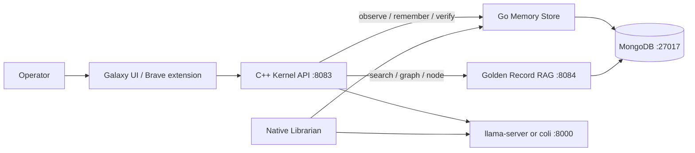

# GodBrain Architecture

GodBrain is a local-first system that separates inference, retrieval memory,
durable teachings, privileged execution, and operator interfaces. Models generate
text and propose work; deterministic host components decide what data is read and
which side effects are permitted.

Rails for agents live in [`AGENTS.md`](AGENTS.md). Source wins if a doc disagrees
with code.

## Architecture summary

One loop on one Windows host, not an agent graph. Discover → plan → execute →
verify, then repeat or stop. The bottleneck is the verifier, not the model.

| Listener | Process | Job |
|---|---|---|
| `:27017` | Windows service `MongoDB` | Vault. Immutable sources + Golden Records. |
| `:8084` | `rag-service.exe` | Committed Golden Record search / graph / document. |
| `:8000` | `llama-server` or `coli serve` | One GPU mouth. Chat and Librarian share it. |
| `:8083` | `godbrain-kernel.exe` | Galaxy, HTTP API, privileged `command_type`. Loopback chat. |

Heal/Watch keep those listeners up. Librarian distills transcripts into
**candidate** Golden Records. The operator `/verify` or `/reject` crowns truth.
Playbooks stay candidate until a human judges. Host inventory and Learn-backed
facts can auto-verify when a live probe or quote actually matches.

A second node is allowed only when a named signal pays for it (distinct
specialty, real parallelism that does not share the GPU slot, a different
runner behind the same chat door, an auditable verify/reject branch, or an
overloaded verifier). Deleting a node that leaves the same result means the
node was costume.

Nothing privileged talks to Mongo except the Memory Store and the RAG service.
Chat generate stays on loopback. Every Tailscale route requires
`Authorization: Bearer`, including GET glances. That door does not host
`/api/chat`. Experimental Go/Rust routers on `:8082` are alternatives, not a
cluster; this host runs the C++ kernel.

### Goals

- Run interchangeable local language models behind one chat door.
- Retrieve local knowledge before inference without coupling memory to one model.
- Persist distilled, provenance-aware teachings across sessions.
- Keep privileged host execution behind an authenticated native boundary.
- Support Windows-native execution on this host (one GPU slot).
- Fail explicitly when a dependency, write, process, or verification step fails.

### Non-goals

- Kernel-mode or Ring 0 execution.
- Loopback or CORS as authentication.
- LLM reasoning as authorization.
- Archived Neo4j as a runtime dependency.
- A decentralized cluster or infinite scale.
- Automatic execution of model output as a tool call.
- Agent Factory as the next node.

## Parts

| Category | File | Read it for |
|---|---|---|
| Currently in place | [`docs/architecture/current.md`](docs/architecture/current.md) | What ships and is exercised on this desk |
| Next phase | [`docs/architecture/next.md`](docs/architecture/next.md) | Pointer: b-line shipped. Snapshot [`b-line.md`](docs/architecture/b-line.md). Remaining later is [`future.md`](docs/architecture/future.md) |
| Future planned | [`docs/architecture/future.md`](docs/architecture/future.md) | Factory, later library policy, experimental trees — ranked, not a backlog |
| Setup and replication | [`docs/architecture/setup.md`](docs/architecture/setup.md) | MongoDB, builds, logon, Watch, mouth, token, first desk check |
| Advanced details | [`docs/architecture/reference.md`](docs/architecture/reference.md) | HTTP tables, inventory, env vars, sequence diagrams, collections |

Earlier domain pages (`runtime`, `alexandria`, `security-and-ops`, `research`)
are pointers into this split so old links still resolve.

## Layout

| Place | What lives there |
|---|---|
| Repo root | Operator doors: `Start-GodBrain`, Heal, Watch, Install, CS2, desk test. `README.md`, `AGENTS.md`, `ARCHITECTURE.md`. |
| `scripts/` | Helpers: Librarian, llama mouth, Ask, digest, pipeline. Not scheduled-task entrypoints. |
| `docs/` | Architecture parts plus research markdown (Factory roster, Oracle strategies, Polymarket notes). |
| `godbrain_core/` | Kernel, Memory Store, RAG, Galaxy, SRE tools. |
| `inbox/` | Raw drop for Librarian. Immutable after ingest. |

Root is the operator contract: what you run at logon, what Watch `-File`s,
what an agent reads first, what GitHub shows. Folders are implementation and
research. Do not empty the root down to `README.md`. Do not move Start / Heal
/ Watch into `scripts/` without a GO and a task re-register.
