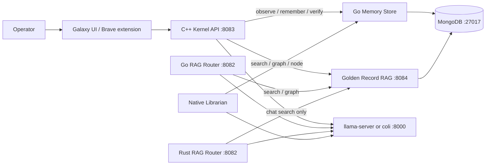
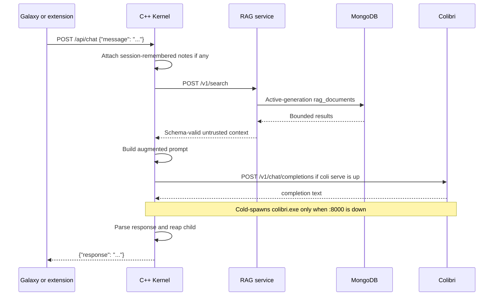
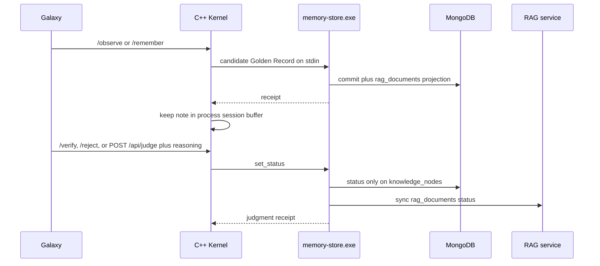
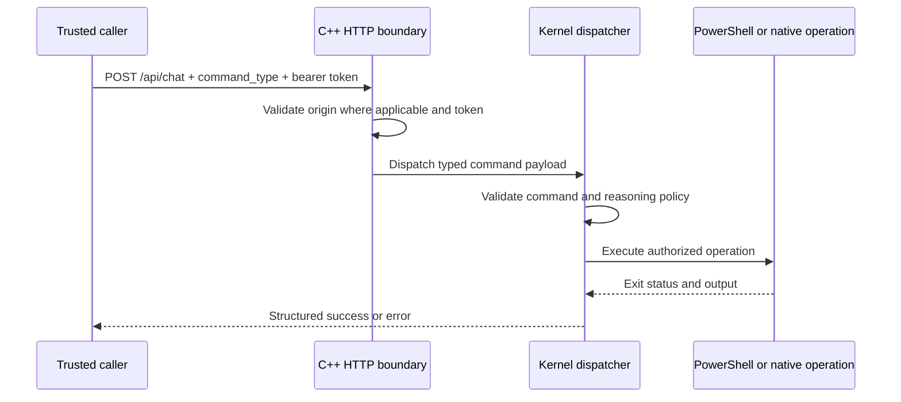
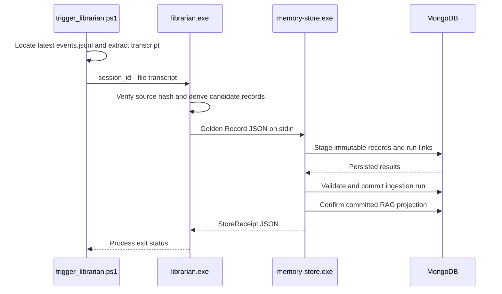

# GodBrain Architecture

GodBrain is a local-first system that separates inference, retrieval memory,
durable teachings, privileged execution, and operator interfaces. Models generate
text and propose work; deterministic host components decide what data is read and
which side effects are permitted.

This document describes the repository as it exists today. Planned Agent Factory
components are explicitly marked and specified separately in
[`AGENT_FACTORY_ROSTER.md`](AGENT_FACTORY_ROSTER.md).

## Goals

- Run interchangeable local or remote language models behind stable interfaces.
- Retrieve local knowledge before inference without coupling memory to one model.
- Persist distilled, provenance-aware teachings across sessions.
- Keep privileged host execution behind an authenticated native boundary.
- Support Windows-native execution and heterogeneous CPU/GPU/storage hardware.
- Fail explicitly when a dependency, write, process, or verification step fails.

## Non-goals

- GodBrain does not provide kernel-mode or Ring 0 execution.
- Loopback binding and CORS are not substitutes for authentication.
- LLM reasoning is not authorization.
- The archived Neo4j implementation is not an active runtime dependency.
- The current runtime is not a decentralized cluster or infinitely scalable.
- Model output is not automatically executed as a tool call.

## Default control loop

GodBrain ships as **one loop**, not an agent graph. Discover → plan → execute →
verify, then repeat or stop. A second node is allowed only when a named signal
forces it (distinct specialty, real parallelism that does not share the one
GPU slot, a different runner behind the same chat door, an auditable
verify/reject branch, or a dedicated reviewer because the verifier is
overloaded). The bottleneck is the verifier, not the model.

Implemented loops:

| Loop | Discover | Execute | Verify |
|---|---|---|---|
| Heal / Watch | Probe ports + HTTP `rag /health.ready` and mouth `/health`; count `inbox\*.txt` | Start allowlist; one flushdns; `rag-rebuild` if projection unready (cooldown); one inbox file when mouth is idle; quarantine poison files; `POST /api/observe` | Ports + ready; live `inbox=N` on `/brief`; Librarian claims stay **candidate**; remember on act/fail |
| Oracle chat | User question or CONTINUE | `coli serve` 160-token slices | Fail-closed RAG, loop abort, operator `/verify` `/reject` |
| Librarian | Transcript | Distill claims (not a recap) | Schema/provenance; contradiction and open_question stay **candidate** |
| Judgment | Last Oracle turns, host card if candidate, and the newest unverified Golden Records | `set_godbrain_status` / `POST /api/judge` | Why string ≥ 4 chars; last-oracle inbox flips with Mongo; cards stay candidate until `/verify` |
| Named-card | 12-char id in chat | RAG `GET /v1/document` | Return that Golden Record; no GPU; do not mint a new Oracle turn |
| Truth loop | Host pin / Learn quote / allowlisted probe | `observe` + `POST /api/truth` | Live read or quote match auto-`verified`; pin mismatch → `stale` |

Do not introduce LangGraph, multi-agent meshes, or a second coli serve to
"orchestrate." The smallest honest extra node later is a **conflict queue**
(candidate vs verified), not an org chart.

### Before a large change

Work like a contractor who bills for rework. Investigate the repo first.
Anything findable in a minute is not a question. Ceremony scales with blast
radius: a typo or one-obvious-form patch under ~20 lines ships in the same
turn; schema, auth, money, migration, or any delete gets a written Goal,
0–3 blocking questions (each with a recommended default), falsifiable
assumptions, and a file-level plan — then stop until the operator accepts
or says yes-to-all. If an assumption dies mid-implementation, stop. Do not
quietly switch designs.

Assumptions, when required, are specific: data shape and trust, failure
mode (retry / fail loud / degrade), public vs internal API, concurrency
and idempotency, this Windows host (no LocalSystem Colibri, one GPU
slot), explicit non-goals, and what will actually be tested.

### Each iteration

1. Rules stay in `AGENTS.md` — do not re-prompt the constitution.
2. Execute the approved plan (or the obvious one-liner).
3. Verify on the live listeners (`:8083` `:8084` `:8000`) or the
   affected test, not only by reading the patch.
4. Persist (git, `last_oracle.json`, Heal remember as candidate). The next
   loop starts there, not from chat memory.

## Status vocabulary

| Status | Meaning |
|---|---|
| **Implemented** | Present in the repository and exercised by an existing runtime path |
| **Experimental** | Buildable prototype or alternative implementation, not the canonical production path |
| **Planned** | Architectural contract exists, but the component is not yet implemented |

## System context



Nothing privileged talks to Mongo except the Memory Store and the RAG service.
The C++ kernel and the Go router do not query `nodes` and do not use `mongosh`.
The Rust router can chat through `:8084` but still returns `410` for graph/node.
The three routers are alternatives, not a cluster. Go and Rust share port
`8082`, so only one of those two can bind at a time.

## Component inventory

| Component | Status | Path | Interface | Responsibility |
|---|---|---|---|---|
| Mouth (`llama-server` or `coli serve`) | Implemented | `Start-LlamaServer.ps1`, `LLM/colibri_LLM/c/` | OpenAI chat on `127.0.0.1:8000` | One GPU generate slot. This host's default mouth is Gemma 12B Q4 via llama-server. Colibri is the interchangeable engine, not the protocol. |
| C++ Kernel | Implemented, canonical privileged boundary | `godbrain_core/cpp_kernel/` | HTTP on `127.0.0.1:8083` | Galaxy hosting, Golden Record RAG via `:8084`, Colibri invocation, privileged command dispatch |
| Root Go router | Experimental alternative | `main.go` | HTTP on `127.0.0.1:8082` | Golden Record RAG via `:8084` and Colibri invocation |
| Rust router | Experimental alternative | `godbrain_core/rust_router/` | HTTP on `127.0.0.1:8082` | Golden Record chat via `:8084`; graph/node still `410` |
| MongoDB knowledge store | Implemented dependency | Local MongoDB | MongoDB protocol on `localhost:27017` | Source documents and RAG records |
| Go Memory Store | Implemented write path | `godbrain_core/memory_store/` | JSON on stdin, MongoDB driver outbound | Validate and persist provenance-aware Golden Records with append-only run links |
| Golden Record RAG service | Implemented retrieval path | `godbrain_core/memory_store/cmd/rag-service/` | HTTP on `127.0.0.1:8084` | Bounded committed-only search, graph, and document reads with source-resolved citations |
| Native Librarian | Implemented, deterministic local distillation | `godbrain_core/cpp_tools/librarian.cpp` | CLI and child process | Derive a bounded Golden Record from a transcript and invoke the Memory Store |
| Galaxy UI | Implemented | `godbrain_core/frontend/galaxy.html` | Browser UI served by the C++ Kernel | Graph browsing and chat |
| Brave extension | Implemented client | `brave_extension/` | HTTP to `127.0.0.1:8083` | Page-context-assisted local chat |
| Native ingestors and SRE tools | Experimental | `godbrain_core/cpp_ingestors/`, `godbrain_core/cpp_tools/`, `godbrain_core/sre_agent/` | Standalone executables | Ingestors plus `sre_surgeon --toolkit` / `--diagnose`. Gated repairs need an operator GO. |
| Heal / Watch | Implemented host loop | `Heal-GodBrain.ps1`, `Watch-GodBrain.ps1` | schtasks / `/api/heal` | Detect TCP then HTTP ready, start missing allowlist, diagnose icmp/dns/nic, flushdns once after a DNS miss, `rag-rebuild` if the projection is unready, drain one `inbox\*.txt` when the mouth is idle, verify, remember on act/fail. Never kills. Claims stay candidate. release / winsock / ip reset / DeviceCleanup / reboot need an operator GO; Heal does not run them. |
| CS2 pause | Implemented host loop | `Start-CS2.ps1`, `Watch-Cs2Pause.ps1`, `GodBrain-Cs2.ps1` | launch script + schtask backup | Pause coli, then launch Steam app 730. Resume 5 minutes after `CS2.exe` exits. Watcher covers Steam Play. |
| Agent Factory control plane | Planned, **not next** | See `AGENT_FACTORY_ROSTER.md` | Versioned job/evidence contracts | Do not staff this to grow the wiki. The next library brick is Librarian ingest, not a roster. |

## Runtime boundaries

### Inference boundary: Colibri

The mouth is a child process, not an in-process library. Galaxy chat prefers an
already-running OpenAI door on `127.0.0.1:8000` (`POST /v1/chat/completions`)
so the model stays resident in VRAM. On this host that is `llama-server` when
`logs/mouth.txt` says llama. If `:8000` is down the kernel **refuses** to
cold-spawn a 16 GB snapshot. Heal/Watch start the configured mouth instead.

The Colibri React web UI (Chat/Brain/Profiling) is an engine workshop. It is
not the GodBrain operator UI and must not be used for RAG, `/observe`, or
judgment. Keep `coli serve` for inference; keep Galaxy for GodBrain.

The repository contains CPU, CUDA, and Metal-related implementation paths. Which
model can run is determined by the model snapshot and available hardware; the
architecture does not require a specific parameter count or model family.

### Retrieval boundary: MongoDB

MongoDB stores both legacy source-oriented router records and Alexandria Golden
Records. Ordinary chat, Galaxy graph, and node lookup go through the Golden
Record service on `127.0.0.1:8084`. That service uses the Go driver and an
indexed, generation-addressed `rag_documents` projection. It never mixes legacy
`nodes` into committed Alexandria results.

MongoDB is the source of truth for both runtime retrieval documents and
Alexandria Golden Records. These use separate collections and validated schemas.

### Teaching boundary: MongoDB

Map the research vault onto collections, not onto Obsidian folders:

| Vault idea | GodBrain |
|---|---|
| `/raw` (never edit) | Immutable sources in Memory Store |
| `/wiki` (processed, trustworthy) | Committed Golden Records / `rag_documents` |
| `/questions` | `open_question` candidates; Oracle must not guess |
| Contradiction flag | `contradiction` candidate; both sides stay until `/verify` or `/reject` |
| Weekly digest | Pointer over **processed** records only (not implemented as a scheduler) |

Librarian extracts claims. It does not overwrite raw and it does not crown truth.

The Go Memory Store is the validated Golden Record write boundary:

1. Read one JSON payload from stdin.
2. Validate schema, source hash, trust tier, ingestion identity, and lease.
3. Persist immutable sources and knowledge nodes.
4. Associate nodes with ingestion attempts through append-only `run_node_links`.
5. Commit the ingestion state only after staging and validation succeed.
6. Materialize the committed run into `rag_documents` and append-only
   `rag_provenance`.
7. Return success only after the projection is confirmed; projection failure
   leaves the run committed and makes an idempotent retry repair it.

The archived Neo4j implementation remains under `archive/neo4j/` for historical
reference and is not part of the active build or runtime.

### Execution boundary: C++ Kernel

The C++ Kernel is the only HTTP component that exposes the privileged
`command_type` dispatch path. It binds to `127.0.0.1:8083`.

Ordinary local chat and read endpoints remain unauthenticated. A request carrying
`command_type` additionally requires:

- `Authorization: Bearer <GODBRAIN_API_TOKEN>`
- A configured server-side `GODBRAIN_API_TOKEN`
- A non-empty `reasoning` string for high-risk commands
- A recognized command type

If the token is absent or invalid, the request is rejected with `401` or `403`.
The token is not logged.

The current dispatcher supports:

- `execute_godbrain_script`
- `propose_sovereign_architect_change`
- `save_godbrain_thought` (candidate Golden Record via `memory-store.exe`)
- `query_recent_thoughts` (newest active-generation `rag_documents`)
- `set_godbrain_status` (`verified`, `rejected`, or `stale` with reasoning)
- `get_system_telemetry`
- `observe_godbrain_host` (Windows inventory + `os_pin`; auto-verified sensor)
- `promote_godbrain_claim` (`POST /api/truth`: host_fact / doc_fact / playbook)

Ordinary Galaxy chat also accepts `/observe`, `/remember`, `/verify`, `/reject`, and
`/recall` without a bearer token. These are loopback teach/judgment, not
privileged host execution. `/observe` writes a stable host inventory (computer name, total RAM, logical
CPU count, fixed volumes with letter/label/total GB) as `candidate`. Live
CPU/RAM and free disk space are shown and not stored.
`/remember` writes only `candidate`. `/observe` auto-verifies the live pin
(`EditionID/CurrentBuild.UBR`). `POST /api/truth` auto-verifies a `host_fact`
when an allowlisted probe matches, or a `doc_fact` when a Learn/support
quote is actually on the page. Playbooks stay `candidate`. When `os_pin`
changes, verified `windows-sre` cards that embed a different `os_pin=` become
`stale`. Oracle RAG search is `verified` only. `/verify` and
`/reject` remain the human door for playbooks and contradictions. Rejected
nodes stay in source collections but are hidden from default search and the
Galaxy graph. `rejected` is terminal. Content never changes; only status does.

The first two can execute arbitrary PowerShell after authorization. This is an
intentional high-risk capability, not a sandbox. The planned Agent Factory must
replace raw scripts with typed, capability-scoped operations where possible.

`wsudo` or an elevated process token provides privileged user-mode execution. It
does not provide kernel-mode access.

## HTTP surfaces

### C++ Kernel (`127.0.0.1:8083`)

| Method | Route | Authentication | Purpose |
|---|---|---|---|
| `GET` | `/` | None | Redirect to Galaxy |
| `GET` | `/galaxy` | None | Serve the operator UI |
| `GET` | `/frontend/*` | None | Static frontend assets |
| `GET` | `/api/test` | None | Liveness response |
| `GET` | `/api/graph` | None | Bounded Golden Record graph for Galaxy (`rag_documents`, max 500 nodes) |
| `GET` | `/api/node` | None | Single Golden Record document by `node_id` or `stable_id` |
| `GET` | `/api/status` | None | Kernel, `coli serve`, VRAM plan, RAG health, last Oracle turn |
| `GET` | `/api/last` | None on loopback | On-disk Oracle turns (no Colibri call) |
| chat `/brief` | None | One-glance host + coli + last turn; prepends `logs/where-we-are.md` if present |
| `POST` | `/api/remember` | Bearer if `GODBRAIN_API_TOKEN` is set | Save a candidate idea (Shortcuts / Brave / iPhone) |
| `POST` | `/api/librarian` | Bearer if `GODBRAIN_API_TOKEN` is set | Distill `text` via the live `:8000` mouth; same door on Tailscale |
| `POST` | `/api/observe` | Bearer if `GODBRAIN_API_TOKEN` is set | Store host inventory as a candidate |
| `POST` | `/api/truth` | Bearer if `GODBRAIN_API_TOKEN` is set | host_fact / doc_fact / playbook; probes and Learn quotes can promote; playbooks stay candidate |
| `POST` | `/api/judge` | Bearer if `GODBRAIN_API_TOKEN` is set | Set a node `verified` or `rejected` with reasoning |
| `POST` | `/api/chat` | None for ordinary chat | RAG plus streamed Colibri inference |
| `POST` | `/api/chat` with `command_type` | Bearer token; reasoning for high-risk commands | Direct privileged kernel dispatch |

The Kernel accepts CORS only from exact trusted loopback/Tauri origins. CORS
controls browser access; non-browser callers still require authentication for
privileged commands.

`GET /api/status` also reports live host inventory, the newest `windows-sre`
Golden Record, and Tailscale (`ip`, `remember_url`, `librarian_url`, `writes`, `bound`).
Privileged `command_type` and Galaxy stay on `127.0.0.1`. If Tailscale is up
and `GODBRAIN_API_TOKEN` is set, a second listener on the Tailscale IPv4
exposes only `/api/remember`, `/api/librarian`, `/api/observe`, `/api/judge`,
`/api/status`, and `/api/last`. Those routes require the bearer on that listener. Loopback
`/api/status` and `/api/last` stay open for Galaxy. Without a token the door
stays closed so the tailnet cannot read inventory or write.

Ordinary chat asks Colibri with `stream: true`. Prefill keepalives and tokens
are forwarded as SSE (`Accept: text/event-stream`). Oracle answers are stored
as candidate Golden Records and in `last_oracle.json` (replace in place).
`/last` replays that log without starting a generate.

### Golden Record RAG service (`127.0.0.1:8084`)

| Method | Route | Authentication | Purpose |
|---|---|---|---|
| `GET` | `/health` | None | Readiness, generation, and retrieval-mode watermarks |
| `POST` | `/v1/search` | None | Bounded lexical or measured hybrid retrieval |
| `GET` | `/v1/graph` | None | Bounded active-generation node list (`limit` default 250, max 500) |
| `GET` | `/v1/document` | None | One active-generation document by `id` (`node_id` hex or `stable_id`) |

Graph and document reads require a ready corpus and fail closed with `503` when
the projection is unready. Graph links are a bounded star of nodes that share a
`source_hash` (or, if that is empty, a `run_id`) in `rag_provenance`. They are
not semantic knowledge-graph edges.

### Go and Rust alternatives (`127.0.0.1:8082`)

These provide similar graph/chat routes with different implementation tradeoffs.
They do not expose the C++ Kernel's privileged command dispatcher. Their CORS
configuration accepts trusted local/Tauri origins only.

They are useful for comparison and migration experiments, but deployment must
choose one because they share a port.

## Runtime flows

### Ordinary chat and RAG



If RAG is down but the kernel process has session notes from `/remember` or
`/observe`, chat still answers from that buffer. Kernel boot hydrates that
buffer from the newest Golden Records so a restart does not forget the host.
If both are empty, the request fails closed. A timed-out Colibri child must not
kill unrelated processes.

Galaxy `GET /api/graph` and `GET /api/node` use the same RAG service
(`/v1/graph`, `/v1/document`) and the same fail-closed rule.

### Observe, remember, and judge



### Privileged command



Colibri text is not automatically scanned and executed. A trusted caller must
construct a separate authenticated `command_type` request.

### Session distillation



Every layer propagates failure through a non-zero exit code. The trigger prints
success only after MongoDB reports a committed or idempotent ingestion.

## Data ownership and provenance

| Data | Source of truth | Required provenance |
|---|---|---|
| Retrieved articles, CVEs, SRE notes | MongoDB | Source URL or origin, retrieval time, content hash, type/tags |
| Session transcript | Copilot session state / retained source artifact | Session ID, timestamp, content hash |
| Golden Record | MongoDB through Go Memory Store | Source hash/session, extractor and schema versions, model/prompt hashes, ingestion run and attempt |
| Runtime logs | Local process logs | Component, request/job ID, timestamp, severity |
| Agent Factory evidence | Planned append-only Evidence Store | Job ID, attempt, before/after hashes, producer |

Derived summaries must reference their source records. Deduplication should create
relationships or supersession markers rather than delete source evidence.

## Security model

### Trust zones

1. **Untrusted input:** Browser text, retrieved web content, database documents,
   and model output.
2. **Local application zone:** UI and ordinary RAG APIs on loopback.
3. **Privileged execution zone:** Authenticated C++ Kernel dispatch.
4. **Credential zone:** Environment-provided API, MongoDB, and future capability
   credentials.
5. **External services:** Market APIs, advisory sources, and other
   explicitly configured endpoints.

Data never becomes executable merely because it came from a model or database.

### Current controls

- Routers and the Golden Record RAG service bind to loopback only.
- Browser CORS is restricted to trusted local/Tauri origins.
- Privileged HTTP dispatch requires a bearer token.
- High-risk kernel commands require non-empty reasoning.
- MongoDB connection configuration is read from the environment.
- Child-process timeouts target the exact spawned process.
- UI text is inserted through text nodes rather than raw HTML.

### Known limitations

- A bearer token is a coarse capability; it does not yet scope individual
  commands, resources, or time windows.
- Ordinary local chat/graph routes are intentionally unauthenticated.
- Raw PowerShell remains available behind the privileged boundary.
- Chat, graph, and node lookup go through the loopback RAG service rather than
  a native MongoDB driver in C++.
- Default Golden Record retrieval is lexical MongoDB text search. Hybrid
  retrieval is opt-in behind a pinned loopback embedding provider.
- Galaxy graph links are provenance co-occurrence (`same_source` / `same_run`),
  not typed `knowledge_edges`. Those edges are indexed but not written yet.
- The experimental Rust router still returns `410` for `/api/graph` and
  `/api/node`.
- Structured audit events, approval records, and automated rollback belong to
  the planned Agent Factory control plane.

## Configuration

| Variable | Used by | Purpose |
|---|---|---|
| `GODBRAIN_API_TOKEN` | C++ Kernel | Bearer token for privileged `command_type` requests |
| `GODBRAIN_COLIBRI_PATH` | C++/Go/Rust routers and SRE tools | Override the Colibri executable path for cold spawn |
| `GODBRAIN_COLIBRI_MODEL` | C++ Kernel | Model id sent to `coli serve` (default `glm-5.2-colibri`) |
| `GODBRAIN_COLIBRI_KEY` | C++ Kernel | Bearer token for `coli serve` if `COLI_API_KEY` is set |
| `GODBRAIN_FRONTEND_DIR` | C++ and Go routers | Override the Galaxy static-file directory |
| `GODBRAIN_SNAPSHOT_PATH` | Routers and SRE tools | Override the model snapshot directory |
| `GODBRAIN_CUDA_EXPERT_GB` | C++ Kernel | Override Colibri VRAM expert budget; default is dedicated VRAM minus 4 GB on ≤16 GB cards |
| `GODBRAIN_COLI_OVERCOMMIT` | C++ Kernel | `1` allows Colibri to spill experts into system RAM (the slow path). Default off |
| `GODBRAIN_LIBRARIAN_PATH` | `trigger_librarian.ps1` | Override `librarian.exe` |
| `LLM_RUNNER_PATH` | Native Librarian | Override the Colibri executable used for framed inference |
| `MONGO_STORE_PATH` | Native Librarian | Override `memory-store.exe` |
| `GODBRAIN_TEMP_DIR` | Native ingestors | Override temporary script/output location |
| `GODBRAIN_TELEMETRY_LOG` | ETW daemon prototype | Override telemetry log location |
| `MONGODB_URI` | Go Memory Store and Golden Record RAG tools | Required MongoDB connection string |
| `MONGODB_DB_NAME` | Go Memory Store and Golden Record RAG tools | Override the `godbrain` database name |
| `GODBRAIN_RAG_PORT` | Golden Record RAG service | Override loopback port `8084`; bind address is not configurable |
| `GODBRAIN_RAG_PREFERRED_SCHEMA_VERSION` | Golden Record RAG service | Optional schema version ranking preference |

MongoDB currently defaults to `mongodb://localhost:27017` and database
`godbrain`.

Secrets must not be committed, logged, inserted into prompts, or stored in graph
records.

## Deployment topology

After a Windows reboot, Mongo should come back as its own service. GodBrain
itself is **not** an SCM service (CUDA/Colibri cannot run as LocalSystem).
Register a current-user logon task instead:

```powershell
.\Install-GodBrainLogon.ps1
```

That runs `Start-GodBrain.ps1` when you sign in and starts whichever of
`rag-service.exe`, `coli serve`, and `godbrain-kernel.exe` actually exist.
Missing binaries are skipped and logged under `logs\`.

### Minimal C++ path

1. Start MongoDB on `localhost:27017`.
2. Build/configure Colibri and set `GODBRAIN_COLIBRI_PATH` and
   `GODBRAIN_SNAPSHOT_PATH` when defaults do not apply.
3. Set a high-entropy `GODBRAIN_API_TOKEN` if privileged commands are required.
4. Build and start the C++ Kernel.
5. Open `http://127.0.0.1:8083/galaxy` or use the Brave extension.

### Golden Record path

1. Start MongoDB and set `MONGODB_URI`.
2. Run `build_pipeline.ps1` to build `memory-store.exe`, `rag-service.exe`,
   `rag-rebuild.exe`, and `librarian.exe`.
3. Set `LLM_RUNNER_PATH`, `GODBRAIN_SNAPSHOT_PATH`, and optional binary overrides.
4. Run `trigger_librarian.ps1`.
5. Run `rag-rebuild.exe` once to project committed records written before this
   retrieval layer, then start `rag-service.exe`.

### Alternative router path

Start either the root Go router or the Rust router on `127.0.0.1:8082`, not both.
These paths require MongoDB and Colibri but do not host privileged kernel
dispatch.

## Failure and recovery behavior

- Startup fails when a required database dependency cannot be reached.
- Child-process spawn and timeout errors return failure rather than synthetic
  model output.
- Database writes are consumed before success is reported.
- Test cleanup failures return non-zero.
- The Librarian propagates Memory Store failure to its caller.
- A post-commit projection failure is explicit. The committed source records are
  not rolled back or marked failed; retrying ingestion or running
  `rag-rebuild.exe` repairs the derivative projection.
- Rebuilds populate a non-active generation, reconcile committed node and
  provenance counts, then atomically switch one metadata pointer. Retired
  generations are deleted only after the maximum request lifetime has elapsed.
- Generated build artifacts are excluded from source control.

Automated state snapshots, rollback execution, durable retries, and lease
recovery are planned Agent Factory responsibilities, not current guarantees.

## Observability

Current components primarily emit process-local text logs and exit codes. A
production control plane should standardize:

- Structured JSON logs with component, request/job ID, attempt, and severity.
- Request latency, queue depth, child-process duration, timeout, and error metrics.
- Database query/write latency and failure counters.
- Audit events for authentication, policy decisions, privileged execution, and
  rollback.
- Correlation IDs propagated across router, Librarian, Memory Store, and agents.

Logs must redact bearer tokens, credentials, private keys, and sensitive prompt
content.

## Agent Factory (later, not this host's next node)

A factory is allowed only when a named signal pays for the node (see Default
control loop). This host has one GPU slot and one `last_oracle.json`. Growing
Alexandria is Librarian + `/verify`, not Architect/Surgeon/Verifier agents.

See [`AGENT_FACTORY_ROSTER.md`](AGENT_FACTORY_ROSTER.md) if that contract is
ever staffed. Do not treat it as the backlog for Jarvis.

## Architectural decisions still required

1. Replace coarse bearer authorization with short-lived capability grants.
2. Define versioned HTTP, job, result, and evidence JSON Schemas.
3. Define retention and supersession policy for immutable MongoDB source and
   Golden Record collections.
4. Decide whether typed `knowledge_edges` should be written by the Librarian
   and replace the current provenance co-occurrence stars in Galaxy.
5. Add structured audit storage and recovery semantics before enabling autonomous
   privileged execution. Not a standing allow on BIOS, DISM, or registry cocktails.
