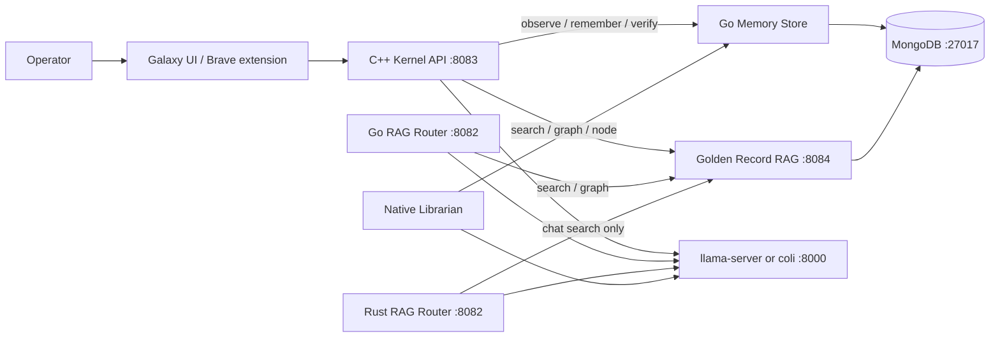

# GodBrain Architecture

GodBrain is a local-first system that separates inference, retrieval memory,
durable teachings, privileged execution, and operator interfaces. Models generate
text and propose work; deterministic host components decide what data is read and
which side effects are permitted.

This page is the map. Detail lives in four parts so Jarvis, Alexandria, ops, and
research stop sharing one wall of text.

| Part | What it covers |
|---|---|
| [Runtime (kernel, mouth, Heal, HTTP)](docs/architecture/runtime.md) | `:8083` Galaxy + GET doors, one GPU mouth, Heal/Watch, CS2 pause, `/edit` |
| [Alexandria (Librarian, Memory Store, RAG)](docs/architecture/alexandria.md) | Immutable sources, candidate Golden Records, `:8084` retrieval |
| [Security and ops](docs/architecture/security-and-ops.md) | Trust zones, bearer, config, logon deploy, failure, logs |
| [Research and later](docs/architecture/research.md) | Experimental routers, market/contracts, Agent Factory, ranked later decisions |

Rails for agents live in [`AGENTS.md`](AGENTS.md). Source wins if a doc disagrees
with code.

## Goals

- Run interchangeable local language models behind one chat door.
- Retrieve local knowledge before inference without coupling memory to one model.
- Persist distilled, provenance-aware teachings across sessions.
- Keep privileged host execution behind an authenticated native boundary.
- Support Windows-native execution on this host (one GPU slot).
- Fail explicitly when a dependency, write, process, or verification step fails.

## Non-goals

- GodBrain does not provide kernel-mode or Ring 0 execution.
- Loopback binding and CORS are not substitutes for authentication.
- LLM reasoning is not authorization.
- The archived Neo4j implementation is not an active runtime dependency.
- The current runtime is not a decentralized cluster or infinitely scalable.
- Model output is not automatically executed as a tool call.
- Agent Factory is not the next node. See [research](docs/architecture/research.md).

## Default control loop

GodBrain ships as **one loop**, not an agent graph. Discover → plan → execute →
verify, then repeat or stop. A second node is allowed only when a named signal
forces it (distinct specialty, real parallelism that does not share the one
GPU slot, a different runner behind the same chat door, an auditable
verify/reject branch, or a dedicated reviewer because the verifier is
overloaded). The bottleneck is the verifier, not the model.

Implemented loops:

| Loop | Discover | Execute | Verify |
|---|---|---|---|
| Heal / Watch | Probe ports + HTTP `rag /health.ready` and mouth `/health`; count `inbox\*.txt` | Start allowlist; one flushdns; `rag-rebuild` if projection unready (cooldown); one inbox file when mouth is idle; quarantine poison files; `POST /api/observe`; `sre_surgeon --diagnose` only when layer ≠ ok | Ports + ready; live `inbox=N` on `/brief`; Librarian claims stay **candidate**; remember on act/fail |
| Oracle chat | User question or CONTINUE | Mouth on `:8000` (llama-server or `coli serve`) | Fail-closed RAG, loop abort, operator `/verify` `/reject` |
| Librarian | Transcript or `inbox\*.txt` | Distill claims (not a recap) through the live mouth | Schema/provenance; contradiction and open_question stay **candidate** |
| Judgment | Last Oracle turns, host card if candidate, and the newest unverified Golden Records | `set_godbrain_status` / `POST /api/judge` | Why string ≥ 4 chars; last-oracle inbox flips with Mongo; cards stay candidate until `/verify` |
| Named-card | 12-char id in chat | RAG `GET /v1/document` | Return that Golden Record; no GPU; do not mint a new Oracle turn |
| Truth loop | Host pin / Learn quote / allowlisted probe | `observe` + `POST /api/truth` | Live read or quote match auto-`verified`; pin mismatch → `stale` |

Do not introduce LangGraph, multi-agent meshes, or a second mouth to
"orchestrate." The smallest honest extra node later is a **conflict queue**
(candidate vs verified), not an org chart.

### Before a large change

Work like a contractor who bills for rework. Investigate the repo first.
Anything findable in a minute is not a question. Ceremony scales with blast
radius: a typo or one-obvious-form patch under ~20 lines ships in the same
turn; schema, auth, money, migration, or any delete gets a written Goal,
0–3 blocking questions (each with a recommended default), falsifiable
assumptions, and a file-level plan — then stop until the operator accepts
or says yes-to-all. If an assumption dies mid-implementation, stop. Do not
quietly switch designs.

### Each iteration

1. Rules stay in `AGENTS.md` — do not re-prompt the constitution.
2. Execute the approved plan (or the obvious one-liner).
3. Verify on the live listeners (`:8083` `:8084` `:8000`) or the
   affected test, not only by reading the patch.
4. Persist (git, `last_oracle.json`, Heal remember as candidate). The next
   loop starts there, not from chat memory.

## Status vocabulary

| Status | Meaning |
|---|---|
| **Implemented** | Present in the repository and exercised by an existing runtime path |
| **Experimental** | Buildable prototype or alternative implementation, not the canonical production path |
| **Planned** | Architectural contract exists, but the component is not yet implemented |

## System context

Nothing privileged talks to Mongo except the Memory Store and the RAG service.
The C++ kernel and the Go router do not query `nodes` and do not use `mongosh`.
The Rust router can chat through `:8084` but still returns `410` for graph/node.
The three routers are alternatives, not a cluster. Go and Rust share port
`8082`, so only one of those two can bind at a time.

Chat generate stays on loopback. The Tailscale listener is GET glances plus
bearer writes (`remember` / `librarian` / `observe` / `judge`). It does not
host `/api/chat`.

## Component inventory

| Component | Status | Path | Interface | Responsibility |
|---|---|---|---|---|
| Mouth (`llama-server` or `coli serve`) | Implemented | `Start-LlamaServer.ps1`, `LLM/colibri_LLM/c/` | OpenAI chat on `127.0.0.1:8000` | One GPU generate slot. Desk default is Gemma 12B Q4 via llama-server **with MTP** (`-NoDraft` to disable). Colibri is the interchangeable engine, not the protocol. |
| C++ Kernel | Implemented, canonical privileged boundary | `godbrain_core/cpp_kernel/` | HTTP on `127.0.0.1:8083` | Galaxy hosting, Golden Record RAG via `:8084`, mouth invocation, privileged command dispatch, no-GPU GET doors |
| Root Go router | Experimental alternative | `main.go` | HTTP on `127.0.0.1:8082` | Golden Record RAG via `:8084` and mouth invocation |
| Rust router | Experimental alternative | `godbrain_core/rust_router/` | HTTP on `127.0.0.1:8082` | Golden Record chat via `:8084`; graph/node still `410` |
| MongoDB knowledge store | Implemented dependency | Local MongoDB | MongoDB protocol on `localhost:27017` | Source documents and RAG records |
| Go Memory Store | Implemented write path | `godbrain_core/memory_store/` | JSON on stdin, MongoDB driver outbound | Validate and persist provenance-aware Golden Records with append-only run links |
| Golden Record RAG service | Implemented retrieval path | `godbrain_core/memory_store/cmd/rag-service/` | HTTP on `127.0.0.1:8084` | Bounded committed-only search, graph, and document reads with source-resolved citations |
| Native Librarian | Implemented, deterministic local distillation | `godbrain_core/cpp_tools/librarian.cpp` | CLI, `Invoke-Librarian.ps1`, Heal inbox, `POST /api/librarian` | Derive a bounded Golden Record from a transcript and invoke the Memory Store. Uses the live `:8000` mouth; does not hold VRAM. |
| Galaxy UI | Implemented | `godbrain_core/frontend/galaxy.html` | Browser UI served by the C++ Kernel | Graph browsing, chat, This host vs Pending, SRE glance |
| Brave extension | Implemented client | `brave_extension/` | HTTP to `127.0.0.1:8083` | Page-context-assisted local chat |
| Native ingestors and SRE tools | Experimental | `godbrain_core/cpp_ingestors/`, `godbrain_core/cpp_tools/`, `godbrain_core/sre_agent/` | Standalone executables | Ingestors plus `sre_surgeon --toolkit` / `--diagnose`. Gated repairs need an operator GO. Heal never `--ask`. |
| Heal / Watch | Implemented host loop | `Heal-GodBrain.ps1`, `Watch-GodBrain.ps1` | schtasks / `/api/heal` | Detect TCP then HTTP ready, start missing allowlist, diagnose icmp/dns/nic, flushdns once after a DNS miss, `rag-rebuild` if the projection is unready, drain one `inbox\*.txt` when the mouth is idle, verify, remember on act/fail. Never kills. Claims stay candidate. |
| CS2 pause | Implemented host loop | `Start-CS2.ps1`, `Watch-Cs2Pause.ps1`, `GodBrain-Cs2.ps1` | launch script + schtask backup | Pause mouth and Tailscale, then launch Steam app 730. Resume 5 minutes after `CS2.exe` exits. Watcher covers Steam Play. |
| Agent Factory control plane | Planned, **not next** | See `AGENT_FACTORY_ROSTER.md` | Versioned job/evidence contracts | Do not staff this to grow the wiki. The next library brick is Librarian ingest, not a roster. |

## Now vs later

What actually moves Jarvis on this host is **not** the five Factory-era bullets
that used to end this file. Ranked:

1. **Keep the one loop honest.** Heal/Watch detect → allowlist patch → verify.
   Strengthen the check (`/brief`, `/heal`, `/sre`, desk tests), not the org chart.
2. **Grow the library as candidates.** Inbox + Librarian + `/pending`. Operator
   `/verify` / `/reject` crowns truth. Do not auto-verify playbooks.
3. **Phone glance without GPU.** `/brief`, `/sre`, `/pending`, `/last`, `/doors`
   on Tailscale with bearer. Chat generate stays loopback.
4. **SRE diagnose only until a named GO.** `sre_surgeon --diagnose` when layer
   ≠ ok. No DISM, BIOS, winsock, DeviceCleanup, or registry cocktail from Heal.
5. **One GPU mouth.** llama-server Gemma 12B Q4, MTP on by default, `-NoDraft`
   if it misbehaves. Kernel **refuses** to cold-spawn a 16 GB snapshot when
   `:8000` is down.

The old "architectural decisions still required" list still *correlates* as
long-horizon rails. It is not the backlog. Ranked against the list above, in
[research and later](docs/architecture/research.md#ranked-later-decisions).
