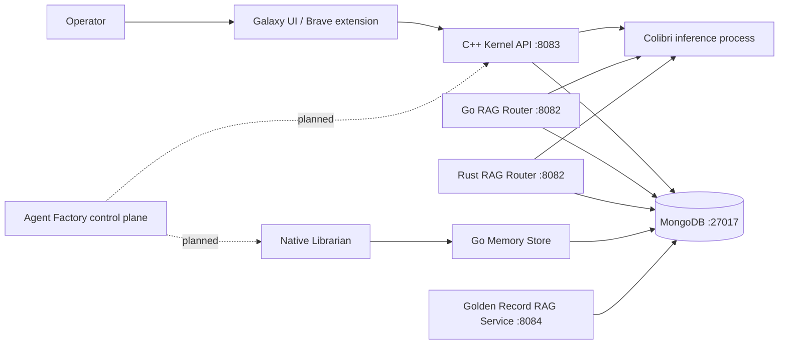
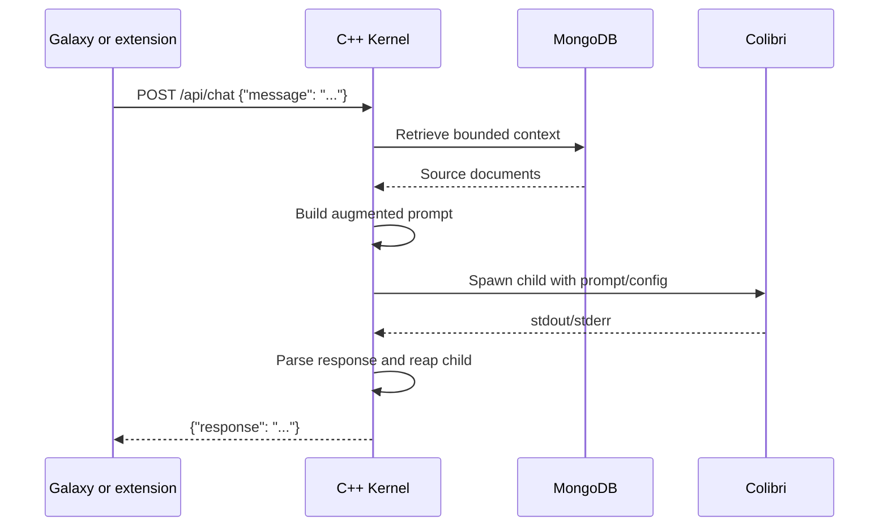
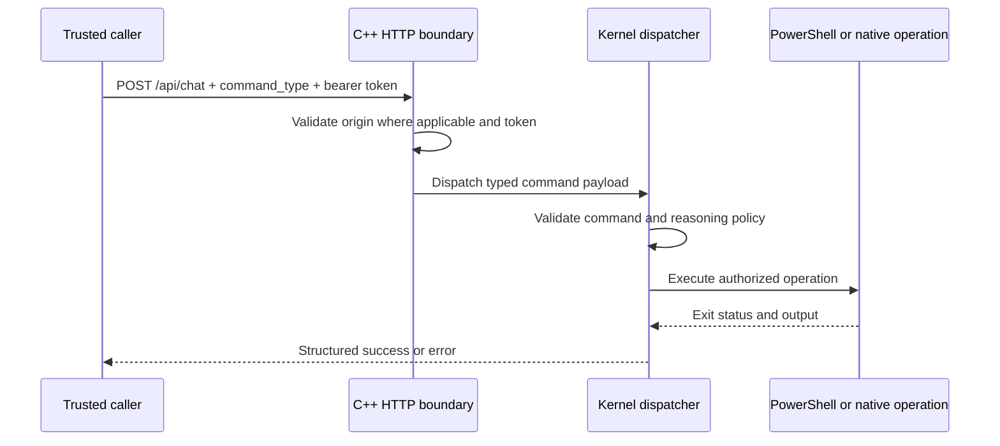
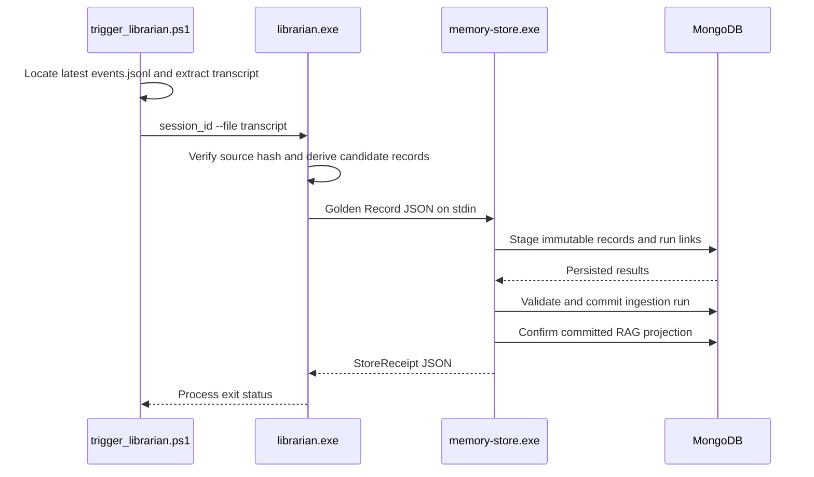

# GodBrain Architecture

GodBrain is a local-first system that separates inference, retrieval memory,
durable teachings, privileged execution, and operator interfaces. Models generate
text and propose work; deterministic host components decide what data is read and
which side effects are permitted.

This document describes the repository as it exists today. Planned Agent Factory
components are explicitly marked and specified separately in
[`AGENT_FACTORY_ROSTER.md`](AGENT_FACTORY_ROSTER.md).

## Goals

- Run interchangeable local or remote language models behind stable interfaces.
- Retrieve local knowledge before inference without coupling memory to one model.
- Persist distilled, provenance-aware teachings across sessions.
- Keep privileged host execution behind an authenticated native boundary.
- Support Windows-native execution and heterogeneous CPU/GPU/storage hardware.
- Fail explicitly when a dependency, write, process, or verification step fails.

## Non-goals

- GodBrain does not provide kernel-mode or Ring 0 execution.
- Loopback binding and CORS are not substitutes for authentication.
- LLM reasoning is not authorization.
- The archived Neo4j implementation is not an active runtime dependency.
- The current runtime is not a decentralized cluster or infinitely scalable.
- Model output is not automatically executed as a tool call.

## Status vocabulary

| Status | Meaning |
|---|---|
| **Implemented** | Present in the repository and exercised by an existing runtime path |
| **Experimental** | Buildable prototype or alternative implementation, not the canonical production path |
| **Planned** | Architectural contract exists, but the component is not yet implemented |

## System context

The three routers are alternatives, not a load-balanced cluster. The Go and Rust
routers both use port `8082`, so only one can bind that port at a time.

## Component inventory

| Component | Status | Path | Interface | Responsibility |
|---|---|---|---|---|
| Colibri C engine | Implemented | `LLM/colibri_LLM/c/` | Child process and environment | Local model inference and memory-tiered model loading |
| C++ Kernel | Implemented, canonical privileged boundary | `godbrain_core/cpp_kernel/` | HTTP on `127.0.0.1:8083` | Galaxy hosting, MongoDB-backed RAG, Colibri invocation, privileged command dispatch |
| Root Go router | Experimental alternative | `main.go` | HTTP on `127.0.0.1:8082` | MongoDB-backed RAG and Colibri invocation |
| Rust router | Experimental alternative | `godbrain_core/rust_router/` | HTTP on `127.0.0.1:8082` | MongoDB-backed RAG and asynchronous Colibri invocation |
| MongoDB knowledge store | Implemented dependency | Local MongoDB | MongoDB protocol on `localhost:27017` | Source documents and RAG records |
| Go Memory Store | Implemented write path | `godbrain_core/memory_store/` | JSON on stdin, MongoDB driver outbound | Validate and persist provenance-aware Golden Records with append-only run links |
| Golden Record RAG service | Implemented lexical retrieval path | `godbrain_core/memory_store/cmd/rag-service/` | HTTP on `127.0.0.1:8084` | Bounded committed-only search with source-resolved citations |
| Native Librarian | Implemented, deterministic local distillation | `godbrain_core/cpp_tools/librarian.cpp` | CLI and child process | Derive a bounded Golden Record from a transcript and invoke the Memory Store |
| Galaxy UI | Implemented | `godbrain_core/frontend/galaxy.html` | Browser UI served by the C++ Kernel | Graph browsing and chat |
| Brave extension | Implemented client | `brave_extension/` | HTTP to `127.0.0.1:8083` | Page-context-assisted local chat |
| Native ingestors and SRE tools | Experimental | `godbrain_core/cpp_ingestors/`, `godbrain_core/cpp_tools/`, `godbrain_core/sre_agent/` | Standalone executables | Data ingestion, diagnostics, and bounded native automation prototypes |
| Agent Factory control plane | Planned | See `AGENT_FACTORY_ROSTER.md` | Versioned job/evidence contracts | Policy, scheduling, capability grants, verification, audit, and recovery |

## Runtime boundaries

### Inference boundary: Colibri

Colibri is a child process, not an in-process library. Routers pass the prompt and
runtime configuration using stdin and/or environment variables, capture stdout
and stderr, enforce a timeout, and terminate only the child they started.

The repository contains CPU, CUDA, and Metal-related implementation paths. Which
model can run is determined by the model snapshot and available hardware; the
architecture does not require a specific parameter count or model family.

### Retrieval boundary: MongoDB

MongoDB stores both legacy source-oriented router records and Alexandria Golden
Records. The current C++ Kernel and alternative Go/Rust routers still query the
legacy `nodes` collection; they do not consume Golden Records. The canonical
Golden Record service uses the Go driver and an indexed, generation-addressed
`rag_documents` projection. It never mixes legacy `nodes` into committed
Alexandria results.

MongoDB is the source of truth for both runtime retrieval documents and
Alexandria Golden Records. These use separate collections and validated schemas.

### Teaching boundary: MongoDB

The Go Memory Store is the validated Golden Record write boundary:

1. Read one JSON payload from stdin.
2. Validate schema, source hash, trust tier, ingestion identity, and lease.
3. Persist immutable sources and knowledge nodes.
4. Associate nodes with ingestion attempts through append-only `run_node_links`.
5. Commit the ingestion state only after staging and validation succeed.
6. Materialize the committed run into `rag_documents` and append-only
   `rag_provenance`.
7. Return success only after the projection is confirmed; projection failure
   leaves the run committed and makes an idempotent retry repair it.

The archived Neo4j implementation remains under `archive/neo4j/` for historical
reference and is not part of the active build or runtime.

### Execution boundary: C++ Kernel

The C++ Kernel is the only HTTP component that exposes the privileged
`command_type` dispatch path. It binds to `127.0.0.1:8083`.

Ordinary local chat and read endpoints remain unauthenticated. A request carrying
`command_type` additionally requires:

- `Authorization: Bearer <GODBRAIN_API_TOKEN>`
- A configured server-side `GODBRAIN_API_TOKEN`
- A non-empty `reasoning` string for high-risk commands
- A recognized command type

If the token is absent or invalid, the request is rejected with `401` or `403`.
The token is not logged.

The current dispatcher supports:

- `execute_godbrain_script`
- `propose_sovereign_architect_change`
- `save_godbrain_thought`
- `query_recent_thoughts`
- `get_system_telemetry`

The first two can execute arbitrary PowerShell after authorization. This is an
intentional high-risk capability, not a sandbox. The planned Agent Factory must
replace raw scripts with typed, capability-scoped operations where possible.

`wsudo` or an elevated process token provides privileged user-mode execution. It
does not provide kernel-mode access.

## HTTP surfaces

### C++ Kernel (`127.0.0.1:8083`)

| Method | Route | Authentication | Purpose |
|---|---|---|---|
| `GET` | `/` | None | Redirect to Galaxy |
| `GET` | `/galaxy` | None | Serve the operator UI |
| `GET` | `/frontend/*` | None | Static frontend assets |
| `GET` | `/api/test` | None | Liveness response |
| `GET` | `/api/graph` | None | Read a bounded MongoDB graph projection |
| `POST` | `/api/chat` | None for ordinary chat | RAG plus Colibri inference |
| `POST` | `/api/chat` with `command_type` | Bearer token; reasoning for high-risk commands | Direct privileged kernel dispatch |

The Kernel accepts CORS only from exact trusted loopback/Tauri origins. CORS
controls browser access; non-browser callers still require authentication for
privileged commands.

### Go and Rust alternatives (`127.0.0.1:8082`)

These provide similar graph/chat routes with different implementation tradeoffs.
They do not expose the C++ Kernel's privileged command dispatcher. Their CORS
configuration accepts trusted local/Tauri origins only.

They are useful for comparison and migration experiments, but deployment must
choose one because they share a port.

## Runtime flows

### Ordinary chat and RAG

Failure to query MongoDB, spawn Colibri, parse output, or finish before the
timeout is reported as an error. A timed-out request must not kill unrelated
Colibri processes.

### Privileged command

Colibri text is not automatically scanned and executed. A trusted caller must
construct a separate authenticated `command_type` request.

### Session distillation

Every layer propagates failure through a non-zero exit code. The trigger prints
success only after MongoDB reports a committed or idempotent ingestion.

## Data ownership and provenance

| Data | Source of truth | Required provenance |
|---|---|---|
| Retrieved articles, CVEs, SRE notes | MongoDB | Source URL or origin, retrieval time, content hash, type/tags |
| Session transcript | Copilot session state / retained source artifact | Session ID, timestamp, content hash |
| Golden Record | MongoDB through Go Memory Store | Source hash/session, extractor and schema versions, model/prompt hashes, ingestion run and attempt |
| Runtime logs | Local process logs | Component, request/job ID, timestamp, severity |
| Agent Factory evidence | Planned append-only Evidence Store | Job ID, attempt, before/after hashes, producer |

Derived summaries must reference their source records. Deduplication should create
relationships or supersession markers rather than delete source evidence.

## Security model

### Trust zones

1. **Untrusted input:** Browser text, retrieved web content, database documents,
   and model output.
2. **Local application zone:** UI and ordinary RAG APIs on loopback.
3. **Privileged execution zone:** Authenticated C++ Kernel dispatch.
4. **Credential zone:** Environment-provided API, MongoDB, and future capability
   credentials.
5. **External services:** Market APIs, advisory sources, and other
   explicitly configured endpoints.

Data never becomes executable merely because it came from a model or database.

### Current controls

- Routers and the Golden Record RAG service bind to loopback only.
- Browser CORS is restricted to trusted local/Tauri origins.
- Privileged HTTP dispatch requires a bearer token.
- High-risk kernel commands require non-empty reasoning.
- MongoDB connection configuration is read from the environment.
- Child-process timeouts target the exact spawned process.
- UI text is inserted through text nodes rather than raw HTML.

### Known limitations

- A bearer token is a coarse capability; it does not yet scope individual
  commands, resources, or time windows.
- Ordinary local chat/graph routes are intentionally unauthenticated.
- Raw PowerShell remains available behind the privileged boundary.
- The C++ RAG path shells out to `mongosh` instead of using an embedded driver.
- Golden Record retrieval is lexical MongoDB text search, not vector or semantic
  search. The active C++/Go/Rust routers are not wired to the service yet.
- Structured audit events, approval records, and automated rollback belong to
  the planned Agent Factory control plane.

## Configuration

| Variable | Used by | Purpose |
|---|---|---|
| `GODBRAIN_API_TOKEN` | C++ Kernel | Bearer token for privileged `command_type` requests |
| `GODBRAIN_COLIBRI_PATH` | C++/Go/Rust routers and SRE tools | Override the Colibri executable path |
| `GODBRAIN_FRONTEND_DIR` | C++ and Go routers | Override the Galaxy static-file directory |
| `GODBRAIN_SNAPSHOT_PATH` | Routers and SRE tools | Override the model snapshot directory |
| `GODBRAIN_LIBRARIAN_PATH` | `trigger_librarian.ps1` | Override `librarian.exe` |
| `LLM_RUNNER_PATH` | Native Librarian | Override the Colibri executable used for framed inference |
| `MONGO_STORE_PATH` | Native Librarian | Override `memory-store.exe` |
| `GODBRAIN_TEMP_DIR` | Native ingestors | Override temporary script/output location |
| `GODBRAIN_TELEMETRY_LOG` | ETW daemon prototype | Override telemetry log location |
| `MONGODB_URI` | Go Memory Store and Golden Record RAG tools | Required MongoDB connection string |
| `MONGODB_DB_NAME` | Go Memory Store and Golden Record RAG tools | Override the `godbrain` database name |
| `GODBRAIN_RAG_PORT` | Golden Record RAG service | Override loopback port `8084`; bind address is not configurable |
| `GODBRAIN_RAG_PREFERRED_SCHEMA_VERSION` | Golden Record RAG service | Optional schema version ranking preference |

MongoDB currently defaults to `mongodb://localhost:27017` and database
`godbrain`.

Secrets must not be committed, logged, inserted into prompts, or stored in graph
records.

## Deployment topology

### Minimal C++ path

1. Start MongoDB on `localhost:27017`.
2. Build/configure Colibri and set `GODBRAIN_COLIBRI_PATH` and
   `GODBRAIN_SNAPSHOT_PATH` when defaults do not apply.
3. Set a high-entropy `GODBRAIN_API_TOKEN` if privileged commands are required.
4. Build and start the C++ Kernel.
5. Open `http://127.0.0.1:8083/galaxy` or use the Brave extension.

### Golden Record path

1. Start MongoDB and set `MONGODB_URI`.
2. Run `build_pipeline.ps1` to build `memory-store.exe`, `rag-service.exe`,
   `rag-rebuild.exe`, and `librarian.exe`.
3. Set `LLM_RUNNER_PATH`, `GODBRAIN_SNAPSHOT_PATH`, and optional binary overrides.
4. Run `trigger_librarian.ps1`.
5. Run `rag-rebuild.exe` once to project committed records written before this
   retrieval layer, then start `rag-service.exe`.

### Alternative router path

Start either the root Go router or the Rust router on `127.0.0.1:8082`, not both.
These paths require MongoDB and Colibri but do not host privileged kernel
dispatch.

## Failure and recovery behavior

- Startup fails when a required database dependency cannot be reached.
- Child-process spawn and timeout errors return failure rather than synthetic
  model output.
- Database writes are consumed before success is reported.
- Test cleanup failures return non-zero.
- The Librarian propagates Memory Store failure to its caller.
- A post-commit projection failure is explicit. The committed source records are
  not rolled back or marked failed; retrying ingestion or running
  `rag-rebuild.exe` repairs the derivative projection.
- Rebuilds populate a non-active generation, reconcile committed node and
  provenance counts, then atomically switch one metadata pointer. Retired
  generations are deleted only after the maximum request lifetime has elapsed.
- Generated build artifacts are excluded from source control.

Automated state snapshots, rollback execution, durable retries, and lease
recovery are planned Agent Factory responsibilities, not current guarantees.

## Observability

Current components primarily emit process-local text logs and exit codes. A
production control plane should standardize:

- Structured JSON logs with component, request/job ID, attempt, and severity.
- Request latency, queue depth, child-process duration, timeout, and error metrics.
- Database query/write latency and failure counters.
- Audit events for authentication, policy decisions, privileged execution, and
  rollback.
- Correlation IDs propagated across router, Librarian, Memory Store, and agents.

Logs must redact bearer tokens, credentials, private keys, and sensitive prompt
content.

## Agent Factory integration

The planned Agent Factory wraps the existing runtime rather than replacing it:

- The Architect creates typed jobs.
- The Policy Engine mints scoped capability grants.
- The Scheduler invokes read-only agents or the Surgeon.
- The Surgeon adapts approved operations to the authenticated C++ Kernel.
- The Verifier evaluates evidence before completion.
- The Recovery Manager applies approved rollback plans.

See [`AGENT_FACTORY_ROSTER.md`](AGENT_FACTORY_ROSTER.md) for the job contracts,
risk classes, lifecycle, and implementation phases.

## Architectural decisions still required

1. Connect a selected non-privileged router to the committed Golden Record RAG
   service or define distinct responsibilities for all router alternatives.
2. Replace coarse bearer authorization with short-lived capability grants.
3. Define versioned HTTP, job, result, and evidence JSON Schemas.
4. Define retention and supersession policy for immutable MongoDB source and
   Golden Record collections.
5. Replace `mongosh` subprocess queries with a native client if the C++ Kernel
   becomes the long-term production router.
6. Add structured audit storage and recovery semantics before enabling autonomous
   privileged execution.
