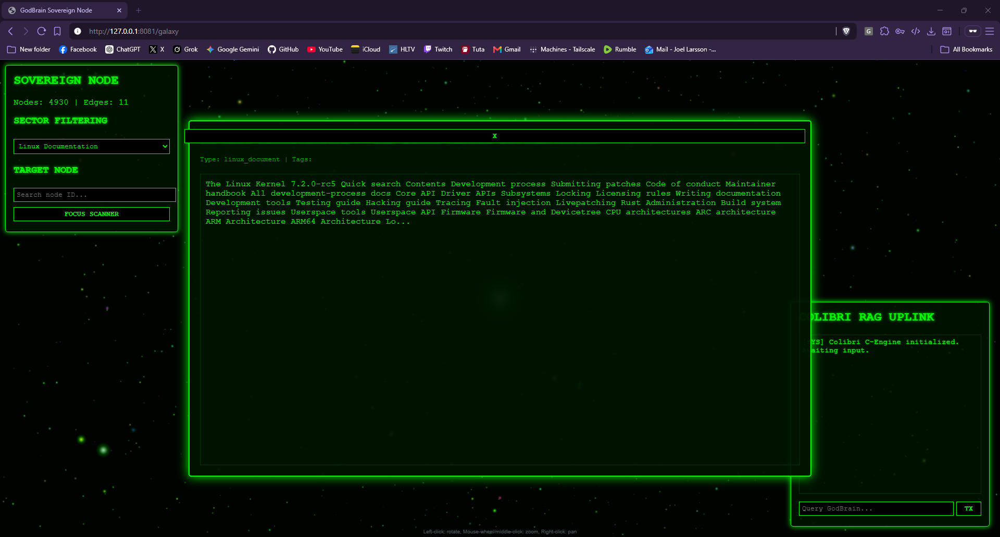

# GodBrain

Use **any** AI model — be it a commercial model through your favorite `-cli` or an LLM of any type.
The most genius part of GodBrain is that it's both **model and tool agnostic**: everything can get boosted by it, and everything can contribute. Train them as a **collective brain & memory**, and unlock tools that default `llama-server` can't do.

## TLDR

The GodBrain turns local models into a shared, sovereign cognitive system. The core idea:

- **🧠 Model-agnostic** — Plug in *any* LLM (Gemma, etc.). No model is special; they're interchangeable nodes in one collective brain.
- **📚 Models teach models** — Past models become **teachings**. Their thoughts and analysis are saved permanently and queried later, so newer models inherit prior reasoning instead of starting from scratch.
- **🛠️ Tools that aren't possible by default** — Native MCP tool use that a stock `llama-server` won't give you: permanent memory, local filesystem read/write/execute, code-graph self-analysis, and more.

## The Compute Cheat Code (Local + Cloud Synergy)

Because the "brain" (MongoDB) is completely decoupled from the compute, GodBrain unlocks a massive hardware cheat code:

- **Massive Local Context — it scales infinitely with your hardware:** As if running *any* model wasn't enough, the shared mind just gets better the more you throw at it.

- On a PC with a 3090, 4090, or 5090? Great — bigger card, better local LLMs, more headroom. But here's where it gets silly: Apple Silicon's unified memory breaks the matrix. A Mac with 128GB+ UMA (think M5 Max and up) runs **100B+ parameter models locally** without paying the insane dedicated-VRAM tax. At that point you're not running a chatbot — you're basically a droid from Star Wars walking around with a sovereign brain in your bag.

- **Hybrid Intelligence:** You aren't limited to local models. Hook up APIs for Grok, Gemini, Codex, or anything else. Let them crunch the massive datasets and commit their insights directly into the GodBrain Memory Engine.
- **Unrestricted Execution:** Your local, uncensored models read those teachings from the shared MongoDB and execute the highly-privileged, unrestricted OS-level operations (like running `wsudo` scripts) that heavily-censored corporate APIs refuse to do.

Trying to match a 128GB Mac on a PC means stacking $10k+ of pro GPUs and a power bill that needs its own reactor. The Mac does it on a laptop, fanless-quiet, for a fraction of the watts — which is exactly the point: It scales infinitely with whatever you've got, so the only ceiling is your hardware budget, not the software.

Cloud models do the heavy context lifting; your local sovereign models pull from the shared memory to execute with God-level permissions.

## See it running

  

<em>The Web Dashboard: A fully interactable 3D force-directed galaxy representing the knowledge graph. Click on any node to open the Sovereign Manual and read the raw documentation, while the RAG uplink stands by on the right.</em>

## How it works

GodBrain routes every model's tool calls through a native C++ kernel instead of patching a specific inference server's chat template:

- **[`godbrain_core/cpp_kernel/main.cpp`](godbrain_core/cpp_kernel/main.cpp)** hosts the HTTP API (bound to `127.0.0.1` only) that any model — Colibri, Gemma, or a commercial API — calls with MCP-style JSON tool calls.
- **[`godbrain_core/cpp_kernel/kernel.cpp`](godbrain_core/cpp_kernel/kernel.cpp)** (`GodBrainKernel::dispatch` / `validate_sovereignty`) is the Circuit Breaker: it intercepts high-risk `command_type`s, requires a non-empty `reasoning` field plus a matching `GODBRAIN_API_TOKEN` bearer token, and only then dispatches the command.
- **[`godbrain_core/memory_store`](godbrain_core/memory_store)** (Go) writes distilled "Golden Records" into the local MongoDB database and serves committed records through the canonical loopback RAG API.
- **[`LLM/colibri_LLM`](LLM/colibri_LLM)** (Colibri, the C-engine) is one of the interchangeable local models GodBrain drives — it is not special-cased into the memory or execution layers.

### Golden Record RAG status

Layer 2 is implemented. The production C++ kernel and the experimental Go and
Rust routers retrieve prompt context only through
`http://127.0.0.1:8084/v1/search`. They validate the generation and
`lexical-v1` contract, preserve bounded citations and trust labels, and wrap
retrieved text as explicitly untrusted reference data. If the service is
unavailable, unready, malformed, oversized, or returns no usable context, chat
fails closed before a model is started. Legacy graph enumeration and direct node
lookup are disabled rather than falling back to the old `nodes` collection.

This layer provides lexical and metadata retrieval only. It does not claim
embedding, vector, semantic-similarity, or hybrid ranking; those remain future
Layer 3 work. Privileged `command_type` dispatch remains a separate C++ request
path protected by the configured bearer token and sovereignty checks.

### GodBrain-native MCP tools

These are the first-class commands the C++ Kernel currently validates and dispatches:

| Tool | Purpose |
|------|---------|
| `save_godbrain_thought` | Permanent memory — write reasoning the next model can learn from |
| `query_recent_thoughts` | Recall prior models' thinking |
| `execute_godbrain_script` | Direct script execution / control (requires `reasoning` + `GODBRAIN_API_TOKEN`) |
| `get_system_telemetry` | Hardware/system awareness |
| `propose_sovereign_architect_change` | Evolve the system's own rules (requires `reasoning` + `GODBRAIN_API_TOKEN`) |

### Why the sovereignty check matters

Any model can emit these tool calls, but `execute_godbrain_script` and `propose_sovereign_architect_change` are high-risk: the kernel rejects them outright unless the payload carries a non-blank `reasoning` string *and* the request's `Authorization` header matches `GODBRAIN_API_TOKEN`. Ordinary read/chat routes (no `command_type`) stay unauthenticated for the local UI.

## The bigger picture

The GodBrain is like 2nd brain by Karpathy's, one of OpenAI founder's, his version is cute for taking notes.
GodBrain is designed to replace web developers and bend the Windows kernel to its will a **Distributed Cognitive OS**: intelligence is decoupled from hardware.
The "mind" lives in shared brain-wires; models contribute sensing, compute, and local agency, and high-leverage teachings persist for every model that follows.

## The End Goal: A Sovereign Autonomous Operator

The destination is an AI that owns the full loop — brainstorm a problem, understand it, and *fix it* across every machine you run, with no hand-holding.

**Working today** — these are shipped and live in the build, not slideware:

- **Self-command** — the agent issues and chains its own commands.
- **Sequential thinking** — multi-step reasoning instead of one-shot guesses.
- **MongoDB query / index / update** — full read-write access to the shared brain.
- **Full local filesystem read/write** — real files, real changes, no sandbox theater.
- **Privileged execution** — `wsudo` scripts and Visual Studio access to actually build and repair.

Put together, that already means GodBrain can reason about a problem, dig through its own memory and code graph, and execute privileged fixes on the local machine — the hard part is done.

**The end goal** — the trajectory these capabilities are converging on:

> A fully autonomous operator that scans the internet for the latest CVEs, *understands* the threat, and auto-patches it across **any** of your machines — Devuan, macOS, or Windows alike. It picks up where tools like DISM fall short, repairs what they should have fixed (registry included), and closes the loop end-to-end because it has both the reasoning and the privileged tooling (`wsudo`, Visual Studio, local execution) to do it.

Cloud models can do the heavy context lifting; your local sovereign models pull from the shared memory and pull the trigger. That's the whole point: **one collective brain, infinite hardware, zero permission-begging.**

### Roadmap

- [x] Self-command + sequential thinking
- [x] MongoDB query / index / update
- [x] Full local filesystem read/write
- [x] Privileged execution (`wsudo`, Visual Studio)
- [ ] Autonomous CVE ingestion (scan + understand latest threats)
- [ ] Cross-fleet patch orchestration (Devuan / macOS / Windows)
- [ ] Self-directed DISM/registry repair beyond stock tooling
- [ ] Closed-loop: detect → reason → patch → verify, zero hand-holding
