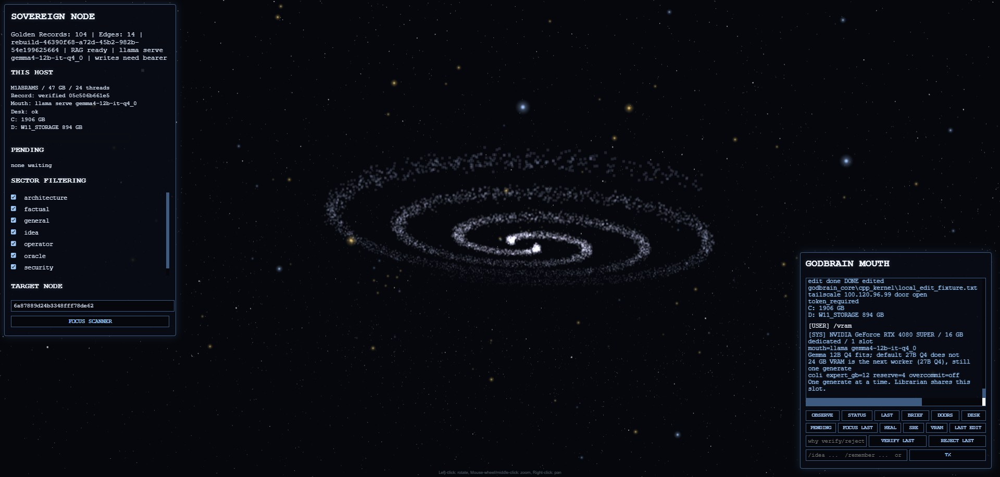

# GodBrain

Local-first Jarvis on this Windows desk. The mouth is an **OpenAI-compatible
loopback** server on `:8000` (desk default: `llama-server`; Colibri is the
interchangeable alternative). Not a commercial `-cli` wrapper and not MCP.
Models inherit the same Golden Records, and the kernel adds tools a stock
`llama-server` will not give you.

## TLDR

The GodBrain turns local models into a shared, sovereign cognitive system. The core idea:

- **🧠 Model-agnostic mouth** — Plug in *any* LLM behind one kernel door (desk default: Gemma 12B on `llama-server`). No model is special; they inherit the same teachings.
- **📚 Models teach models** — Librarian writes **candidate** Golden Records; you `/verify` or `/reject`. Chat retrieves **committed** teachings through rag-service (`:8084`), so the next model does not start from a blank context. That is the query path — not a Mongo shell.
- **🛠️ Tools a stock `llama-server` will not give you** — Kernel `command_type`s: save/recall, skills, host observe, telemetry, privileged PowerShell behind `GODBRAIN_API_TOKEN` + a non-blank `reasoning`. Bounded `/edit` is a separate chat door, not a `command_type`.

## The Compute Cheat Code (vault ≠ GPU)

Mongo + rag-service is the vault. The mouth is just compute. A bigger card, a future cloud ingest, or a 128GB Mac can still read the same Golden Records. This desk is **one generate slot** (Gemma 12B IT Q6_K_L, MTP off). A 3090 replacing the 4080 is still that slot, not a second mouth and not a silent swap to GLM MoE.

Hybrid ingest is real: drop a source in `inbox\` or POST `/api/librarian`. The local mouth extracts **candidates**. You crown them. Cloud models do not skip `/verify`, do not get a Mongo shell, and do not run `wsudo`. Privileged PowerShell still needs bearer + reasoning. Heal does not DISM, rewrite the registry, or patch a fleet.

## See it running

  

<em>Galaxy on this host: 3D graph, This host / Pending on the left, mouth and no-GPU glance buttons on the right.</em>

## How it works

GodBrain routes tool calls through a native C++ kernel instead of patching a
specific inference server's chat template. The mouth must already be an
OpenAI-compatible loopback server on `:8000` (desk default: `llama-server`;
Colibri is the interchangeable alternative). This host does not call a
commercial API, and `.vscode/mcp.json` is empty on purpose.

- **[`godbrain_core/cpp_kernel/main.cpp`](godbrain_core/cpp_kernel/main.cpp)** hosts the HTTP API (bound to `127.0.0.1` only): Galaxy chat, no-GPU glances, `/edit`, and privileged `command_type` JSON. `/edit` is a chat door with an allowlist, not a `command_type`.
- **[`godbrain_core/cpp_kernel/kernel.cpp`](godbrain_core/cpp_kernel/kernel.cpp)** (`GodBrainKernel::dispatch` / `validate_sovereignty`) is the Circuit Breaker: it intercepts high-risk `command_type`s, requires a non-empty `reasoning` field plus a matching `GODBRAIN_API_TOKEN` bearer token, and only then dispatches the command.
- **[`godbrain_core/memory_store`](godbrain_core/memory_store)** (Go) writes distilled "Golden Records" into the local MongoDB database and serves committed records through the canonical loopback RAG API.
- **[`LLM/colibri_LLM`](LLM/colibri_LLM)** (Colibri, the C-engine) is one of the interchangeable local models GodBrain drives — it is not special-cased into the memory or execution layers.

The runtime default is **one loop**, not an agent graph: discover → plan →
execute → verify. Heal/Watch keep `:8084`/`:8000`/`:8083` up. Oracle chat
generates; `/verify last` / `/reject last` is the check for playbooks and
fights. Host inventory and Learn-backed facts promote themselves when a
probe or a quote match is real. Librarian distills transcripts to
**candidates**. The bottleneck is the verifier, not the model. A second node is allowed only when a named
signal pays for it (Architect vs Surgeon, a second inference runner behind
the same kernel door, or a future candidate-vs-verified conflict queue).
Colibri and a rebuilt `llama-server` are interchangeable mouths, not a mesh.

Large changes follow a contractor gate: investigate the repo, state a
Goal and falsifiable assumptions, ask at most three blocking questions
(each with a default), then implement. One-liners skip the ceremony.
Verify on the live ports, then persist. The next loop starts from git and
Golden Records, not from chat history.

Ingest is the same loop with a stricter write rule: **raw sources stay
immutable**; Librarian extracts *new claims*, not a recap; contradictions
are flagged on both sides and never silently overwritten; open questions
stay questions. Chat and any digest read the processed Golden Record
layer, not the raw transcript pile. Routine extract uses the cheap local
runner; a heavier model is only for a flagged fight or a high-stakes
synthesis.

### Golden Record RAG status

Layer 3 is implemented. The production C++ kernel and the experimental Go and
Rust routers retrieve prompt context only through
`http://127.0.0.1:8084/v1/search`. They validate the generation and
`hybrid-v1` contract, preserve bounded citations and trust labels, and wrap
retrieved text as explicitly untrusted reference data. If the service is
unavailable, unready, malformed, oversized, or returns no usable context,
**and** this kernel process has no session notes, chat fails closed before a
model is started. Non-empty process session notes (hydrated from RAG at boot,
or `/remember`) may still go to the mouth without a fresh Golden Record hit.
They do not fall back to the old `nodes` collection. Galaxy graph and node
lookup use the same service (`/v1/graph`, `/v1/document`) and the active
`rag_documents` generation.

Lexical/metadata retrieval remains the zero-configuration canonical fallback.
An optional exact-loopback OpenAI-compatible embedding provider enables
generation-versioned embeddings and deterministic hybrid RRF over a bounded
4,096-document exact-cosine backend. Health and search responses state the exact
mode and degradation reason; they never claim hybrid when the provider, model
identity, projection, or bounded backend is unavailable. The checked-in
synthetic fixture currently measures Recall@K, MRR, and nDCG@K at 1.0 with zero
hidden-record leakage. These are reproducibility checks for the deterministic
fake provider, not real-model quality claims. Privileged `command_type` dispatch
remains a separate C++ request path protected by the configured bearer token and
sovereignty checks.

### Kernel `command_type`s

These are the first-class commands the C++ kernel currently validates and dispatches (JSON on `:8083`, not an IDE MCP server):

| Tool | Purpose |
|------|---------|
| `save_godbrain_thought` | Candidate Golden Record via `memory-store.exe` |
| `query_recent_thoughts` | Newest active-generation `rag_documents` |
| `query_godbrain_skills` | Promoted skills only (untrusted procedure + evidence profile) |
| `record_godbrain_skill_run` | Append harness evidence (`skill_verification_runs`) |
| `promote_godbrain_skill` | Promote after origin is verified **and** a passing run exists |
| `set_godbrain_status` | `verified` / `rejected` / `stale` with reasoning |
| `observe_godbrain_host` | Windows inventory + `os_pin`; auto-verified sensor |
| `promote_godbrain_claim` | `POST /api/truth` host_fact / doc_fact / playbook |
| `get_system_telemetry` | Hardware/system awareness |
| `execute_godbrain_script` | PowerShell (requires `reasoning` + bearer) |
| `propose_sovereign_architect_change` | PowerShell (requires `reasoning` + bearer) |

`/edit` is not in this table. It is an allowlisted chat apply, recorded as
`local-edit-apply-v1`, and cannot promote a skill.

### Why the sovereignty check matters

The mouth can emit these tool calls, but `execute_godbrain_script`,
`propose_sovereign_architect_change`, `record_godbrain_skill_run`, and
`promote_godbrain_skill` are high-risk: the kernel rejects them unless the
payload carries a non-blank `reasoning` string *and* `Authorization: Bearer`
matches `GODBRAIN_API_TOKEN`. Ordinary loopback read/chat routes (no
`command_type`) stay unauthenticated for the local UI. Every Tailscale route
needs the bearer, including GETs.

## The bigger picture

Karpathy's second brain is cute for taking notes. GodBrain is the same idea with a **judge**: raw sources stay immutable, Librarian extracts claims as candidates, you `/verify` or `/reject`, and the next model inherits the processed Golden Records — not the transcript pile.

Two product wants that are not notes:

- **Replace the web-dev loop on this repo.** Galaxy, Tailscale glances, Shortcuts, and allowlisted `/edit` should grow until you do not hire someone to ship GodBrain UI. That is a destination, not "no sandbox, write anything."
- **Models teach models over time.** Chat already retrieves committed teachings through rag-service (`:8084`). `query_recent_thoughts` and `/recall` list newest projected nodes; `/recall <query>` searches **verified** Golden Records through that same API — not `mongosh`, not a MongoDB IDE/MCP plugin against the live vault.

On this host it is **one Windows loop**, not Ring 0, not a Distributed Cognitive OS across Devuan/macOS, and not zero permission-begging. The vault is decoupled from the GPU. The operator is not.

## Working today

Shipped on this desk, not slideware:

- **One loop** — Heal/Watch keep `:27017` / `:8084` / `:8000` / `:8083` up. Discover → allowlist start → verify. Heal does not kill, reboot, DISM, or run the repair cocktail.
- **Teachings in and out of Mongo** — Librarian → `memory-store` (candidate only, fail-closed JSON). Chat/Oracle retrieve through rag-service, never by giving the model a Mongo shell. Oracle search is verified-only.
- **Judge** — `/verify` `/reject` for playbooks and fights. Host probes and Learn quotes auto-verify when the evidence actually matches.
- **Bounded file work** — `/edit` writes root `.ps1` / `.cmd` / `.md`, `scripts\`, `docs\`, `godbrain_core\`. Not vendor/build/LLM/archive. Never `git push` from the mouth.
- **Privileged PowerShell** — `execute_godbrain_script` / `propose_sovereign_architect_change` need bearer + a non-blank `reasoning`. That is `pwsh` via the kernel, not `wsudo`, not Visual Studio as a tool.
- **Operator glance** — `scripts\Show-SystemFlex.ps1` (`flex` on this desk). Host chrome, not `/brief`, not Heal.

The verifier is still the bottleneck. Privileged doors existing is not "the hard part is done."

## The end goal

Wanted on this product (still gated):

- A mouth that ships real UI and host work the way a web dev would — kernel allowlist, then you judge.
- Models that keep inheriting each other's **verified** teachings, including richer rag-service query. Writes stay candidate until `/verify`.

Not this host — several are standing nos. See [`docs/architecture/future.md`](docs/architecture/future.md):

- Autonomous CVE ingest and auto-patch across Devuan / macOS / Windows.
- Self-directed DISM or registry repair. Named GO, one tool, never a standing allow.
- Closed-loop patch with zero hand-holding. Heal already does detect → allowlist → verify; anything past `flushdns` stays GO-gated.

### Roadmap

- [x] Host-listener loop (Heal/Watch: detect → start allowlist → verify → remember)
- [x] Oracle judge loop (`/verify last` / `/reject last`)
- [x] Truth loop (host probe / Learn quote auto-verify; playbooks stay candidate)
- [x] Teachings: Librarian candidates + rag-service retrieve (models inherit committed records)
- [x] Bounded `/edit` + privileged `pwsh` behind bearer + `reasoning`
- [ ] Mouth ships web-dev class GodBrain UI/product work (allowlist grows on purpose, still no mouth `git push`)
- [ ] Richer teaching query for the mouth (still `:8084` / kernel recall, not Mongo MCP)
- [ ] Candidate-vs-verified conflict queue (smallest extra node: overloaded verifier)
- [ ] Autonomous CVE ingestion — not b-line
- [ ] Cross-fleet patch (Devuan / macOS / Windows) — not this machine
- [ ] Self-directed DISM/registry — **no** standing allow
- [ ] Detect → reason → patch → verify with zero hand-holding — Heal is the loop; extra patch stays GO-gated

Current b-line is **this host's OS/network stack** (services, TCP/IP, ICMP, SCM), not tanks or AppX eviction. Heal starts MongoDB, Dnscache, iphlpsvc, nsi, plus rag/mouth/kernel. ICMP loopback is detect-only. Patch grows only from a named, verified signal.

## Credits

This desk's TrustedInstaller shells use [M2-Team Privexec](https://github.com/M2Team/Privexec) `wsudo` from PATH (`wsudo --ti`). GitHub release zips lag `master`; get a current binary with [baulk](https://github.com/baulk/baulk) (`baulk install wsudo`) or build Privexec from source. Do not copy `wsudo.exe` into this repo. GodBrain does not call it from Heal or `cpp_kernel`. If you live on Windows, star [M2-Team](https://github.com/M2Team) — NanaZip, NanaRun, Privexec.
