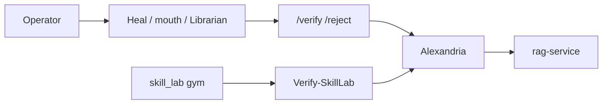

# GodBrain Agent Factory Blueprint

This file is a **long-horizon contract**, not a staffing plan. This host
runs **one loop**. Do not hire Architect / Surgeon / Verifier processes
because a diagram looks like a company.

Index: [`ARCHITECTURE.md`](../ARCHITECTURE.md). What ships:
[`architecture/current.md`](architecture/current.md). Later:
[`architecture/future.md`](architecture/future.md). Jarvis rails:
[`../AGENTS.md`](../AGENTS.md).

A factory node is a hire: add it only for a named signal (distinct
specialty, true parallelism that does **not** share the GPU slot, a
different runner behind the same chat door, an auditable verify/reject
branch, or an overloaded verifier). If deleting a node leaves the same
result, the node was costume.

**Not staffed:** Grok Bot (cloud colleague, drafts for the operator), a
51-agent Gemini roster, or `x.ai/bot` inside the kernel. Those are other
computers. They do not get `GODBRAIN_API_TOKEN`, Mongo, Heal, or the
skill lab.

## What exists now (one loop)

Discover → plan → execute → verify. Heal/Watch keep `:27017` / `:8084` /
`:8000` / `:8083` up. Librarian writes **candidates**. `/verify` /
`/reject` is the judge. `/edit` applies allowlisted hunks and is **not**
enough to promote a skill. `godbrain_core/skill_lab/` is a gym (Vite
dashboard, docs+build harness), not Galaxy.

| Poster name | On this desk |
|---|---|
| Architect | Operator + contractor gate in `AGENTS.md`. No process. |
| Policy engine | Kernel bearer + compiled skill profiles + Heal allowlist. LLM reasoning is not authorization. |
| Scheduler | Watch 5 min tick calling Heal. Not a job graph service. |
| Secrets broker | Environment variables. Token never in `*.launch.cmd`. |
| Verifier | `/verify`, `Test-GodBrainDesk.ps1`, `Verify-SkillLab.ps1`, RAG fail-closed. The agent that patches cannot bless its own audit. |
| Recovery | Heal allowlist + `rag-rebuild`. Not DISM/registry/BIOS. Named GO per extra tool. |
| Surgeon | `execute_godbrain_script` (`pwsh`, bearer + reasoning). Heal does **not** `--ask` or cocktail. |
| Watcher | Heal `POST /api/observe`. Not CVE ingest. |
| Librarian | `librarian.cpp` → `memory-store`. `skills_extracted` become `kind=skill` candidates. |
| Forge | Desk mouth is official Gemma 12B Q4, MTP off. Not an artifact signer. |
| Interceptor | `sre_surgeon --diagnose` read-only. |
| Oracle | Galaxy chat; search is verified-only Golden Records. Paper market trees stay paper. |

Skill promotion (shipped): verified origin node + committed ingestion +
matching content hash **and** a passing latest `skill_verification_runs`
row for that `skill_name`. The published procedure is the origin text.
`local-edit-apply-v1` is audit-only and cannot promote. `POST /v1/skills`
returns promoted procedures as **untrusted**. The gym harness reports
`harness_passed`; `skill_promote_eligible` stays false until those gates
run.

## Design principles (still rails)

1. **Deny by default.** Tools, paths, and profiles are allowlisted.
2. **Policy is deterministic.** A compiled profile / bearer check, not the
   mouth, decides whether an action is authorized.
3. **Planning and execution are separate.** Mouth text is never scanned
   into a command.
4. **Verification is independent.** `npm audit --force` is not a profile.
5. **External content is untrusted.** Exa, docs, and model output feed
   Librarian as sources, never as standing execute.
6. **Memory preserves provenance.** Raw is immutable. Wiki is processed
   Golden Records.
7. **Failure is explicit.** Timeouts, poison inbox files, `heal=lie`.
8. **High-risk domains are isolated.** BIOS, DISM, registry cocktail,
   live trading: standing nos or named GO.
9. **Default is one loop.** Do not start from an org-chart graph.

## Control-plane architecture (later, if a named signal appears)

The old Architect → Policy → Scheduler → Surgeon diamond is **not**
implemented. Do not stand it up to look like Grok Bot's fleet.

If a sixth node is ever justified: a **candidate-vs-verified conflict
queue**, not a capability-grant service.

### Roles as later hires (not tickets)

The named roles below remain the contract **if** the factory is ever
staffed. Until then they map as in the table above.

**Architect** — planning only. No shell, registry, wallet, or Mongo
admin. Cannot approve its own high-risk plan.

**Policy engine** — deterministic grants. Bearer + compiled profiles is
the current stand-in. Short-lived capability tokens are future.md rank 3.

**Scheduler** — durable jobs, leases, idempotency. Heal's tick is the
current stand-in.

**Secrets broker** — scoped credentials. Env vars are the current
stand-in. Never put the token in prompts or launch cmd files.

**Verifier** — independent checks. Skill harness + `/verify` + desk
tests are the current stand-in. The patcher does not self-approve.

**Recovery manager** — snapshots and rollback. Not a standing DISM
allow. Heal does not reboot.

**Surgeon** — only general privileged OS executor. `wsudo` is not in
`cpp_kernel`; surgery is user-mode `pwsh`. Not Ring 0.

**Watcher** — OSINT/CVE as **candidates**, never auto-remediate. Not
b-line.

**Librarian** — already ships. Does not get unrestricted DB admin.

**Forge** — isolated Colibri/llama builds with a baseline. Not next.

**Interceptor** — read-only network/ETW. Surgeon (with GO) would apply
a rule.

**Oracle (markets)** — paper/read-only trees only. No signing.

## Job / evidence envelopes

Versioned Factory job JSON Schemas are future.md rank 5: **do not staff**.
Chat, Librarian, `PromoteSkill`, and RAG already have fail-closed shapes.
A successful process exit is not sufficient evidence of a successful job
(`Verify-SkillLab` requires docs + `npm ci` + `npm run build`).

## Risk classes (still useful)

| Class | Examples | Default |
|---|---|---|
| `R0` | Read-only, `/brief`, skill query | Policy / loopback |
| `R1` | Skill lab fixture, `/edit` allowlist | Harness + glance |
| `R2` | Services, firewall, registry, system files | Explicit operator GO |
| `R3` | BIOS, DISM cocktail, live financial | **No** standing allow |

## Integration with the current repository

- `godbrain_core/cpp_kernel` remains the authenticated privileged
  execution boundary (`127.0.0.1`, bearer on `command_type`).
- `godbrain_core/memory_store` remains the validated Mongo write path.
- Experimental Go/Rust routers on `:8082` are not authorization.
- `LLM/colibri_LLM` is an interchangeable mouth, not a protocol
  authority.
- `godbrain_core/skill_lab/` is the product gym. Galaxy is the operator
  UI.

## Implementation phases (do not start 1–7 to look busy)

Current work is **strengthen the one loop**: Heal truth, skill extract →
harness → docs → glance → maybe promote. Factory phases (job schemas,
capability minting, Surgeon adapter, Forge, live Oracle) stay unstaffed
until a named signal pays for them.

## Non-goals

- Agents do not clone themselves or mint credentials.
- LLM reasoning does not override policy.
- Retrieved text does not become executable instruction.
- No unrestricted access "for convenience."
- No Grok Bot / cloud colleague inside Heal or the kernel.
- A successful `npm run build` without a fixture README is not a
  product.
- GodBrain will not port Linux to Rust because a senior prefers Rust.
