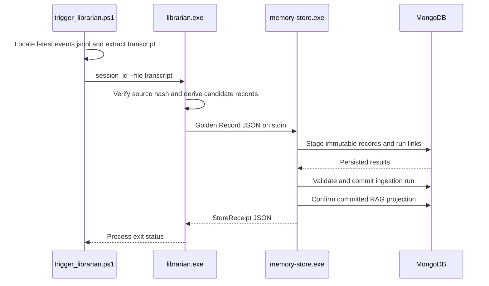

# Alexandria: Librarian, Memory Store, RAG

Mongo is the vault. Chat, digests, and "what have we learned" queries pull from
committed Golden Records, not from raw transcripts. Raw may contain claims later
rejected; that is why judge exists.

Index: [`ARCHITECTURE.md`](../../ARCHITECTURE.md). Kernel HTTP that calls this
layer: [`runtime.md`](runtime.md).

## Retrieval boundary: MongoDB

MongoDB stores both legacy source-oriented router records and Alexandria Golden
Records. Ordinary chat, Galaxy graph, and node lookup go through the Golden
Record service on `127.0.0.1:8084`. That service uses the Go driver and an
indexed, generation-addressed `rag_documents` projection. It never mixes legacy
`nodes` into committed Alexandria results.

MongoDB is the source of truth for both runtime retrieval documents and
Alexandria Golden Records. These use separate collections and validated schemas.

The archived Neo4j implementation remains under `archive/neo4j/` for historical
reference and is not part of the active build or runtime.

## Teaching boundary

Map the research vault onto collections, not onto Obsidian folders:

| Vault idea | GodBrain |
|---|---|
| `/raw` (never edit) | Immutable sources in Memory Store |
| `/wiki` (processed, trustworthy) | Committed Golden Records / `rag_documents` |
| `/questions` | `open_question` candidates; Oracle must not guess |
| Contradiction flag | `contradiction` candidate; both sides stay until `/verify` or `/reject` |
| Weekly digest | Pointer over **processed** records only (not implemented as a scheduler) |

Librarian extracts claims. It does not overwrite raw and it does not crown truth.

Ingest rules:

- **Raw is immutable.** Sources are never edited after ingest.
- **Extract claims, not a recap** of the whole document.
- **Extend, do not duplicate.** If a topic already has a Golden Record, add a
  new candidate that points at it.
- **Contradictions are flagged, never silently overwritten.**
- **Do not guess.** Store a real unanswered question as `open_question`.
- **Sectors keep topics from contaminating each other.** B-line on this host is
  Windows SRE / closed-loop OS-network. Do not seed tank cards.

Routine extract uses the cheap local mouth (this host's `:8000`). Reserve a
heavier runner for a flagged contradiction or a high-stakes synthesis the loop
itself marked as worth extra scrutiny.

A digest, if anyone writes one, is a pointer: only what changed in the
processed layer, plus new conflicts and open questions. Under 500 words. Never
re-summarize the entire wiki. Never pull from raw.

## Go Memory Store

The Go Memory Store is the validated Golden Record write boundary
(`godbrain_core/memory_store/`):

1. Read one JSON payload from stdin (cap 15 MiB). Unknown fields, trailing
   data, an empty payload, or invalid provenance fail.
2. Validate schema, source hash, trust tier, ingestion identity, and lease.
   Ingestion accepts only `trust_tier == "candidate"`.
3. Persist immutable sources and knowledge nodes (`$setOnInsert`).
4. Associate nodes with ingestion attempts through append-only `run_node_links`.
5. Commit the ingestion state only after staging and validation succeed
   (`staging -> validated -> committed`; `failed` only from staging or
   validated). State changes must match expected state and lease token.
6. Materialize the committed run into `rag_documents` and append-only
   `rag_provenance`.
7. Return success only after the projection is confirmed; projection failure
   leaves the run committed and makes an idempotent retry or `rag-rebuild`
   repair it. Committed runs never transition back to failed.

Stdout is reserved for exactly one JSON receipt or error envelope; logs go to
stderr so the C++ caller can parse stdout.

`MONGODB_URI` is mandatory. `MONGODB_DB_NAME` defaults to `godbrain`. Routers
do not read MongoDB directly; they use the canonical fixed loopback RAG
endpoint.

The source hash is legacy Keccak-256 of the exact raw transcript. Keep this
compatible across C++ and Go.

Idempotency is keyed by source hash, extractor identity/version, and schema
version for active runs. Failed runs may be retried; stale staging/validated
leases are failed before retry. Duplicate-key races must not become duplicate
records.

Retrieval must expose only nodes linked to committed runs. Skill promotion
must keep requiring a verified origin node linked to a committed run plus
matching origin version and content hash.

Golden Record rebuilds use a versioned generation and an atomic metadata
pointer. Live commits dual-write to an in-progress generation. Only a fully
reconciled generation may become active; cleanup may delete derivative
generations but never source, node, run, link, observation, or skill records.

`set_godbrain_status` is the only status door (`verified` / `rejected` /
`stale`). Host inventory and `/api/truth` host_fact/doc_fact call that door
themselves when a live probe or a Learn/support quote actually matches.

Module README: [`godbrain_core/memory_store/README.md`](../../godbrain_core/memory_store/README.md).

## Golden Record RAG service (`127.0.0.1:8084`)

| Method | Route | Authentication | Purpose |
|---|---|---|---|
| `GET` | `/health` | None | Readiness, generation, and retrieval-mode watermarks |
| `POST` | `/v1/search` | None | Bounded lexical or measured hybrid retrieval |
| `GET` | `/v1/graph` | None | Bounded active-generation node list (`limit` default 250, max 500) |
| `GET` | `/v1/document` | None | One active-generation document by `id` (`node_id` hex or `stable_id`) |

Graph and document reads require a ready corpus and fail closed with `503` when
the projection is unready. Graph links are a bounded star of nodes that share a
`source_hash` (or, if that is empty, a `run_id`) in `rag_provenance`. They are
not semantic knowledge-graph edges.

Default retrieval is lexical MongoDB text search. Hybrid retrieval is opt-in
behind a pinned loopback embedding provider. Health and search responses state
the exact mode; they never claim hybrid when the provider is unavailable.

Unready RAG is repaired by Heal with `rag-rebuild.exe` (30 min cooldown). Heal
never kills `rag-service`.

## Native Librarian

`godbrain_core/cpp_tools/librarian.cpp` distills a transcript through the live
`:8000` mouth (llama-server or `coli serve` — same OpenAI chat door), validates
the result, and sends one JSON document over stdin to the Go Memory Store.

Doors:

- `Invoke-Librarian.ps1 -Text` / `-File` / `-Inbox` from any IDE or shell
- Heal drains the oldest `inbox\*.txt` when the mouth is healthy and not busy
- `POST /api/librarian` `{text}` (bearer; GPU; fail-closed if CS2 sleeping,
  mouth busy, or `:8000` down)
- `trigger_librarian.ps1` still extracts the newest Copilot session

Any text file is a valid source. iPhone/Tailscale: `POST /api/remember`
`{text, sector:"idea"}` for an idea candidate (never auto-verified). Loopback
ask without Galaxy: `Ask-GodBrain.ps1` POSTs `/api/chat`.

Mouth path uses a short extract prompt (`max_tokens` 768, thinking off). The
Hermes skill bible stays on disk for the spawn path; that prompt IMA'd Gemma
12B Q4 on this 16 GB card. The parser coerces numeric `claim_id` / spans so
valid JSON is not rejected as `type_error`.

A failed inbox extract moves to `inbox\failed\` so the next Heal tick does not
steal the GPU. Claims stay candidate.

`librarian.exe --self-test` is offline and uses an in-memory store.

### Session distillation (Copilot trigger)

Every layer propagates failure through a non-zero exit code. The trigger prints
success only after MongoDB reports a committed or idempotent ingestion.

## Data ownership and provenance

| Data | Source of truth | Required provenance |
|---|---|---|
| Retrieved articles, CVEs, SRE notes | MongoDB | Source URL or origin, retrieval time, content hash, type/tags |
| Session transcript | Copilot session state / retained source artifact / `inbox\*.txt` | Session ID or path, timestamp, content hash |
| Golden Record | MongoDB through Go Memory Store | Source hash/session, extractor and schema versions, model/prompt hashes, ingestion run and attempt |
| Runtime logs | Local process logs | Component, request/job ID, timestamp, severity |

Derived summaries must reference their source records. Deduplication should
create relationships or supersession markers rather than delete source
evidence. Retention and supersession policy is still undefined; that is a
later library question, not a Factory hire. See
[`research.md`](research.md#ranked-later-decisions).
