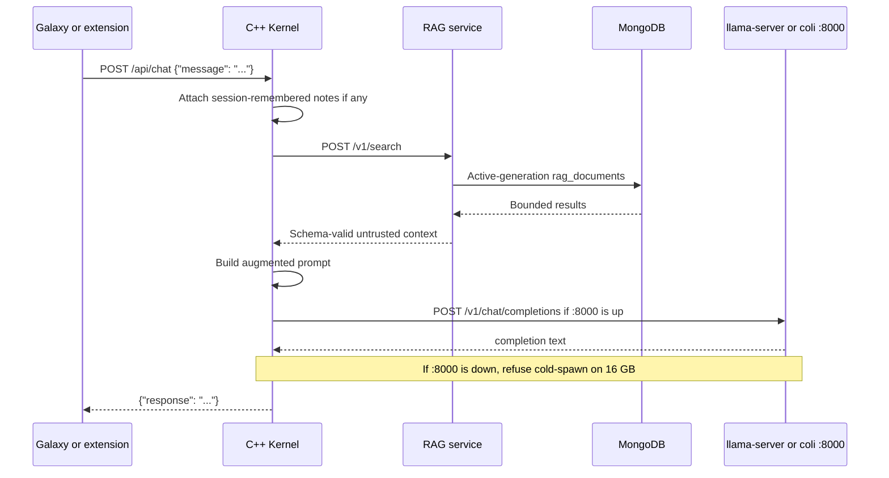
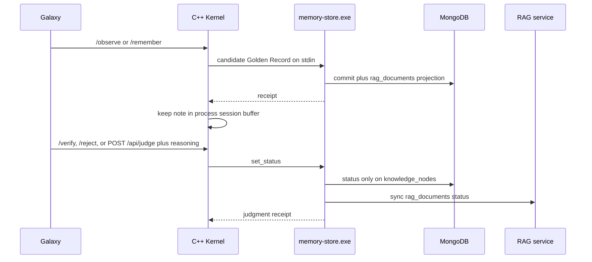
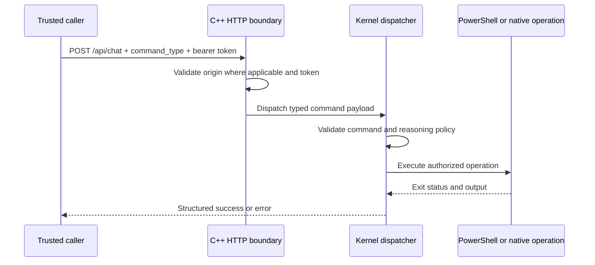
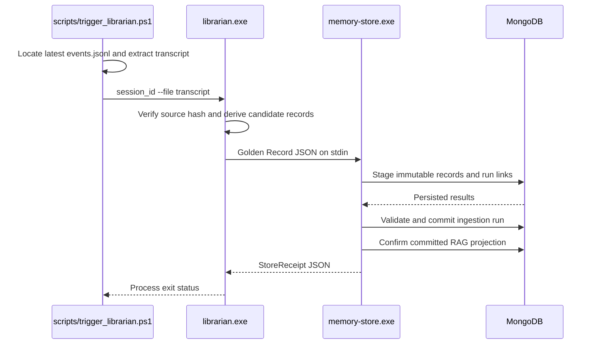

# Advanced details

Tables and sequence diagrams. Narrative: [`current.md`](current.md). Setup:
[`setup.md`](setup.md). Index: [`ARCHITECTURE.md`](../../ARCHITECTURE.md).

## Status vocabulary

| Status | Meaning |
|---|---|
| **Implemented** | Present in the repository and exercised by an existing runtime path |
| **Experimental** | Buildable prototype or alternative implementation, not the canonical production path |
| **Planned** | Architectural contract exists, but the component is not yet implemented |

Golden Record status: `candidate` / `verified` / `rejected` / `stale`.
`set_godbrain_status` is the only status door. `rejected` is terminal. Content
never changes; only status does.

## Implemented loops

| Loop | Discover | Execute | Verify |
|---|---|---|---|
| Heal / Watch | Probe ports + HTTP `rag /health.ready` and mouth `/health`; count `inbox\*.txt` | Start allowlist; one flushdns; `rag-rebuild` if projection unready (cooldown); one inbox file when mouth is idle; quarantine poison files; `POST /api/observe`; `sre_surgeon --diagnose` only when layer ≠ ok | Ports + ready; live `inbox=N` on `/brief`; Librarian claims stay **candidate**; remember on act/fail |
| Oracle chat | User question or CONTINUE | Mouth on `:8000` (llama-server or `coli serve`) | Fail-closed RAG, loop abort, operator `/verify` `/reject` |
| Librarian | Transcript or `inbox\*.txt` | Distill claims (not a recap) through the live mouth | Schema/provenance; contradiction and open_question stay **candidate** |
| Judgment | Last Oracle turns, host card if candidate, and the newest unverified Golden Records | `set_godbrain_status` / `POST /api/judge` | Why string ≥ 4 chars; last-oracle inbox flips with Mongo; cards stay candidate until `/verify` |
| Named-card | 12-char id in chat | RAG `GET /v1/document` | Return that Golden Record; no GPU; do not mint a new Oracle turn |
| Truth loop | Host pin / Learn quote / allowlisted probe | `observe` + `POST /api/truth` | Live read or quote match auto-`verified`; pin mismatch → `stale` |

## Component inventory

| Component | Status | Path | Interface | Responsibility |
|---|---|---|---|---|
| Mouth (`llama-server` or `coli serve`) | Implemented | `scripts/Start-LlamaServer.ps1`, `LLM/colibri_LLM/c/` | OpenAI chat on `127.0.0.1:8000` | One GPU generate slot. Desk default is official Gemma 12B IT Q4_0 **without MTP** (`-UseDraft` to enable). Colibri is the interchangeable engine, not the protocol. |
| C++ Kernel | Implemented, canonical privileged boundary | `godbrain_core/cpp_kernel/` | HTTP on `127.0.0.1:8083` | Galaxy hosting, Golden Record RAG via `:8084`, mouth invocation, privileged command dispatch, no-GPU GET doors |
| Root Go router | Experimental alternative | `main.go` | HTTP on `127.0.0.1:8082` | Golden Record RAG via `:8084` and mouth invocation |
| Rust router | Experimental alternative | `godbrain_core/rust_router/` | HTTP on `127.0.0.1:8082` | Golden Record chat via `:8084`; graph/node still `410` |
| MongoDB knowledge store | Implemented dependency | Local MongoDB | MongoDB protocol on `localhost:27017` | Source documents and RAG records |
| Go Memory Store | Implemented write path | `godbrain_core/memory_store/` | JSON on stdin, MongoDB driver outbound | Validate and persist provenance-aware Golden Records with append-only run links |
| Golden Record RAG service | Implemented retrieval path | `godbrain_core/memory_store/cmd/rag-service/` | HTTP on `127.0.0.1:8084` | Bounded committed-only search, graph, and document reads with source-resolved citations |
| Native Librarian | Implemented | `godbrain_core/cpp_tools/librarian.cpp` | CLI, `scripts/Invoke-Librarian.ps1`, Heal inbox, `POST /api/librarian` | Derive a bounded Golden Record from a transcript and invoke the Memory Store. Uses the live `:8000` mouth; does not hold VRAM. |
| Galaxy UI | Implemented | `godbrain_core/frontend/galaxy.html` | Browser UI served by the C++ Kernel | Graph browsing, chat, This host vs Pending, SRE glance |
| Brave extension | Implemented client | `brave_extension/` | HTTP to `127.0.0.1:8083` | Page-context-assisted local chat |
| Native ingestors and SRE tools | Experimental | `godbrain_core/cpp_ingestors/`, `godbrain_core/cpp_tools/`, `godbrain_core/sre_agent/` | Standalone executables | Ingestors plus `sre_surgeon --toolkit` / `--diagnose`. Gated repairs need an operator GO. Heal never `--ask`. |
| Heal / Watch | Implemented host loop | `Heal-GodBrain.ps1`, `Watch-GodBrain.ps1` | schtasks / `/api/heal` | Detect TCP then HTTP ready, start missing allowlist, diagnose icmp/dns/nic, flushdns once after a DNS miss, `rag-rebuild` if unready, drain one inbox file, verify, remember on act/fail. Never kills. |
| CS2 pause | Implemented host loop | `Start-CS2.ps1`, `Watch-Cs2Pause.ps1` | launch script + schtask backup | Pause mouth and Tailscale, launch Steam app 730, resume 5 minutes after `CS2.exe` exits. |
| Agent Factory control plane | Planned, **not next** | `docs/AGENT_FACTORY_ROSTER.md` | Versioned job/evidence contracts | Do not staff this to grow the wiki. |

## C++ Kernel HTTP (`127.0.0.1:8083`)

| Method | Route | Authentication | Purpose |
|---|---|---|---|
| `GET` | `/` | None | Redirect to Galaxy |
| `GET` | `/galaxy` | None | Serve the operator UI |
| `GET` | `/frontend/*` | None | Static frontend assets |
| `GET` | `/api/test` | None | Liveness response |
| `GET` | `/api/graph` | None | Bounded Golden Record graph (`rag_documents`, max 500 nodes) |
| `GET` | `/api/node` | None | Single Golden Record by `node_id` or `stable_id` |
| `GET` | `/api/status` | None on loopback | Kernel, mouth, VRAM, RAG, last Oracle, `pending_items`, host inventory |
| `GET` | `/api/brief` | None on loopback | One-glance host + mouth + pending + heal + CS2 + last-turn; writes `logs/last-brief.txt` |
| `GET` | `/api/heal` | None on loopback | Same text as `/heal` including `age=`; writes `logs/last-heal.txt` |
| `GET` | `/api/sre` | None on loopback | Layer + last diagnose snapshot (no GPU); writes `logs/last-sre.txt` |
| `GET` | `/api/pending` | None on loopback | Candidate Oracle, candidate host, newest unverified cards (skip `kind=concept` and Heal-loop labels); writes `logs/last-pending.json` |
| `GET` | `/api/last` | None on loopback | On-disk Oracle glance (no mouth); writes `logs/last-oracle.txt` |
| `GET` | `/api/last-edit` | None on loopback | Last local-edit result (no GPU); writes `logs/last-edit.txt` |
| `GET` | `/api/vram` | None on loopback | One GPU slot + next worker size; writes `logs/last-vram.json` |
| `GET` | `/api/doors` | None on loopback | Loopback and Tailscale URLs; chat stays loopback-only |
| `GET` | `/api/desk` | None on loopback | Desk health used by `Test-GodBrainDesk.ps1` |
| `POST` | `/api/remember` | Bearer if token set | Save a candidate idea |
| `POST` | `/api/librarian` | Bearer if token set | Distill `text` via live `:8000`; fail-closed if CS2 sleeping, mouth busy, or `:8000` down |
| `POST` | `/api/observe` | Bearer if token set | Host inventory (Heal each tick; unchanged is idempotent) |
| `POST` | `/api/truth` | Bearer if token set | host_fact / doc_fact / playbook; probes and Learn quotes can promote; playbooks stay candidate |
| `POST` | `/api/judge` | Bearer if token set | `verified` or `rejected` with reasoning; rewrites `logs/last-pending.json` |
| `POST` | `/api/chat` | None for ordinary chat | RAG plus streamed mouth inference; loopback only |
| `POST` | `/api/chat` with `command_type` | Bearer; reasoning for high-risk | Direct privileged kernel dispatch |

CORS: exact trusted loopback/Tauri origins only. CORS is not authorization.

### Tailscale door

Binds when `GODBRAIN_API_TOKEN` is set and the adapter has a 100.x. Every
route on that listener requires bearer, including GETs. Chat generate is not
exposed.

GET: `/api/brief`, `/api/vram`, `/api/heal`, `/api/sre`, `/api/status`,
`/api/last`, `/api/doors`, `/api/desk`, `/api/pending`, `/api/last-edit`.

POST: `/api/remember`, `/api/librarian`, `/api/observe`, `/api/truth`,
`/api/judge`.

### Galaxy slash commands (loopback)

`/observe`, `/vram`, `/remember`, `/idea`, `/ideas`, `/verify`, `/reject`,
`/recall`, `/status`, `/last`, `/brief`, `/pending`, `/heal`, `/sre`, `/edit`,
`/last-edit`, `/doors`.

`/verify last <why>` and `/reject last <why>` judge the newest on-disk Oracle
turn. `/verify <12-char prefix> <why>` resolves against `/pending`.

### Privileged `command_type`

| Tool | Purpose |
|---|---|
| `save_godbrain_thought` | Candidate Golden Record via `memory-store.exe` |
| `query_recent_thoughts` | Newest active-generation `rag_documents` |
| `set_godbrain_status` | `verified` / `rejected` / `stale` with reasoning |
| `get_system_telemetry` | Hardware/system awareness |
| `observe_godbrain_host` | Windows inventory + `os_pin`; auto-verified sensor |
| `promote_godbrain_claim` | `POST /api/truth` host_fact / doc_fact / playbook |
| `execute_godbrain_script` | PowerShell; requires reasoning + bearer |
| `propose_sovereign_architect_change` | PowerShell; requires reasoning + bearer |

## Golden Record RAG (`127.0.0.1:8084`)

| Method | Route | Authentication | Purpose |
|---|---|---|---|
| `GET` | `/health` | None | Readiness, generation, retrieval-mode watermarks |
| `POST` | `/v1/search` | None | Bounded lexical or measured hybrid retrieval |
| `GET` | `/v1/graph` | None | Bounded active-generation node list (`limit` default 250, max 500) |
| `GET` | `/v1/document` | None | One active-generation document by `id` (`node_id` hex or `stable_id`) |

Unready corpus → `503`. Graph links are a bounded star of nodes that share a
`source_hash` (or `run_id`) in `rag_provenance`, not semantic edges. Default
search is lexical; hybrid is opt-in behind a pinned loopback embedding
provider.

## Vault mapping and collections

| Vault idea | GodBrain |
|---|---|
| `/raw` (never edit) | Immutable sources in Memory Store |
| `/wiki` (processed) | Committed Golden Records / `rag_documents` |
| `/questions` | `open_question` candidates |
| Contradiction flag | `contradiction` candidate; both sides stay until judge |
| Weekly digest | Pointer over processed records only (not a scheduler) |

Source-of-truth collections:

| Collection | Contract |
|---|---|
| `sources` | Immutable raw sources keyed by legacy Keccak-256 source hash |
| `knowledge_nodes` | Immutable semantic node versions |
| `run_node_links` | Append-only run-to-node observations, including evidence spans |
| `source_observations` | Append-only external-source ingestion identities |
| `ingestion_runs` | Lease-guarded `staging -> validated -> committed` |
| `skills` | Verified committed-node promotions only |

Derivative collections (`rag_documents`, `rag_provenance`, `rag_embeddings`,
`rag_metadata`) are rebuildable. Cleanup may delete derivative generations,
never source/node/run/link/observation/skill records.

Memory Store: one JSON document on stdin, cap 15 MiB. Ingestion accepts only
`trust_tier == "candidate"`. Stdout is one receipt; logs go to stderr.

## Configuration

| Variable | Used by | Purpose |
|---|---|---|
| `GODBRAIN_API_TOKEN` | C++ Kernel | Bearer for `command_type` and Tailscale door |
| `GODBRAIN_COLIBRI_PATH` | Heal / spawn path | Override Colibri executable. Kernel does not cold-spawn on 16 GB |
| `GODBRAIN_COLIBRI_DIR` | Start-GodBrain | Colibri tree (`../colibri/c` preferred) |
| `GODBRAIN_COLIBRI_MODEL` | C++ Kernel | Model id for `coli serve` (default `glm-5.2-colibri`) |
| `GODBRAIN_COLIBRI_KEY` | C++ Kernel | Bearer for `coli serve` if `COLI_API_KEY` is set |
| `GODBRAIN_FRONTEND_DIR` | C++ and Go routers | Override Galaxy static-file directory |
| `GODBRAIN_SNAPSHOT_PATH` | Routers and SRE tools | Override model snapshot directory |
| `GODBRAIN_CUDA_EXPERT_GB` | C++ Kernel | Override Colibri VRAM expert budget |
| `GODBRAIN_COLI_OVERCOMMIT` | C++ Kernel | `1` allows experts to spill into RAM. Default off |
| `GODBRAIN_LIBRARIAN_PATH` | `scripts/trigger_librarian.ps1` | Override `librarian.exe` |
| `GODBRAIN_LIBRARIAN_SPAWN` | Native Librarian | `1` allows Librarian to cold-spawn Colibri. Default off |
| `LLM_RUNNER_PATH` | Native Librarian | Override Colibri executable for framed inference |
| `MONGO_STORE_PATH` | Native Librarian | Override `memory-store.exe` |
| `GODBRAIN_TEMP_DIR` | Native ingestors | Override temp script/output location |
| `GODBRAIN_TELEMETRY_LOG` | ETW daemon prototype | Override telemetry log location |
| `MONGODB_URI` | Memory Store and RAG tools | Required MongoDB connection string |
| `MONGODB_DB_NAME` | Memory Store and RAG tools | Override database `godbrain` |
| `GODBRAIN_RAG_PORT` | RAG service | Override loopback port `8084`; bind address is not configurable |
| `GODBRAIN_RAG_PREFERRED_SCHEMA_VERSION` | RAG service | Optional schema version ranking preference |

Secrets must not be committed, logged, inserted into prompts, or stored in
graph records.

## Runtime flows

### Ordinary chat and RAG

If RAG is down but the kernel has session notes from `/remember` or
`/observe`, chat still answers from that buffer. Boot hydrates the buffer from
the newest Golden Records. If both are empty, fail closed.

### Observe, remember, and judge

### Privileged command

### Librarian (Copilot trigger)

Heal inbox and `scripts/Invoke-Librarian.ps1` use the same Librarian → Memory Store
path, with the live `:8000` mouth.

## Trust zones and controls

1. Untrusted input: browser text, retrieved web, DB documents, model output.
2. Local application zone: UI and ordinary RAG APIs on loopback.
3. Privileged execution zone: authenticated C++ Kernel dispatch.
4. Credential zone: env-provided API and MongoDB credentials.
5. External services: market APIs and other explicitly configured endpoints.

Data never becomes executable merely because it came from a model or database.

Current controls: loopback binds, CORS allowlist, bearer for `command_type` and
the Tailscale door, non-empty reasoning for high-risk commands, exact-child
process timeouts, text nodes in the UI (not raw HTML), Heal never kills and
never runs the repair cocktail.

Known limitations: bearer is coarse; ordinary loopback chat is unauthenticated;
raw PowerShell exists behind the privileged boundary; Galaxy links are
provenance stars; Rust router graph/node is `410`; structured audit belongs to
Factory and is required *before* anyone enables autonomous privileged
execution — which this host is not doing.

## Failure and logs

- Startup fails when a required database dependency cannot be reached.
- Spawn/timeout errors return failure, not synthetic model output.
- Projection failure after commit is explicit; `rag-rebuild` repairs; committed
  runs never go back to failed.
- Failed inbox extracts move to `inbox\failed\`.
- If `:8000` is down, chat and Librarian fail closed (or Heal/status kick
  Start-LlamaServer). No 16 GB cold-spawn.

| File | Written by |
|---|---|
| `logs/last-brief.txt` | `/brief`, Heal |
| `logs/last-heal.txt` | `/heal` |
| `logs/last-sre.txt` | `/sre`, Start-GodBrain |
| `logs/last-pending.json` | `/pending`, `/verify`, `/reject` |
| `logs/last-vram.json` | `/vram`, Heal |
| `logs/last-oracle.txt` | `/last` |
| `logs/last-edit.txt` | `/last-edit` |
| `logs/heal-last.json` | Heal |
| `logs/where-we-are.md` | `scripts/Write-SessionDigest.ps1` |
| `logs/mouth.txt` | mouth starter |

Logs must redact bearer tokens, credentials, private keys, and sensitive
prompt content.
