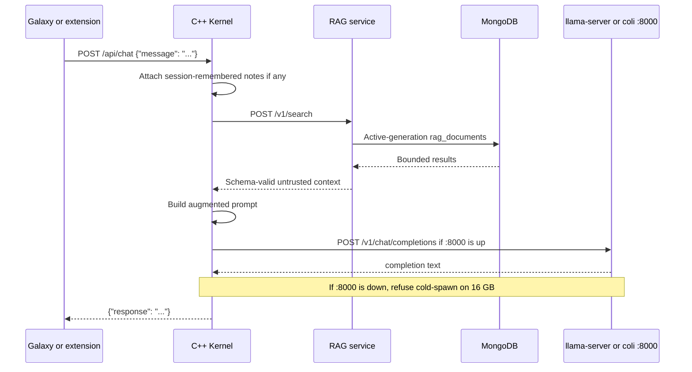
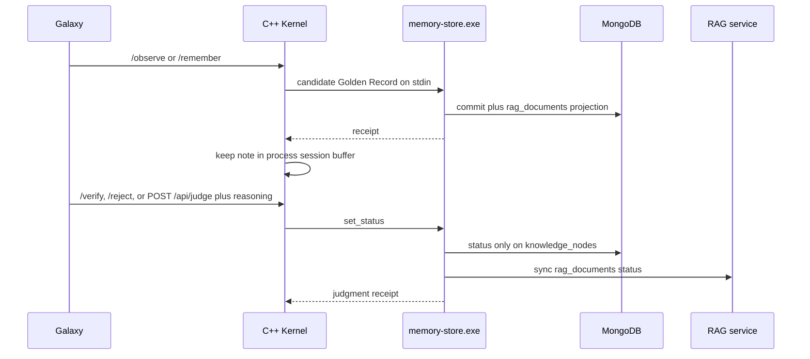
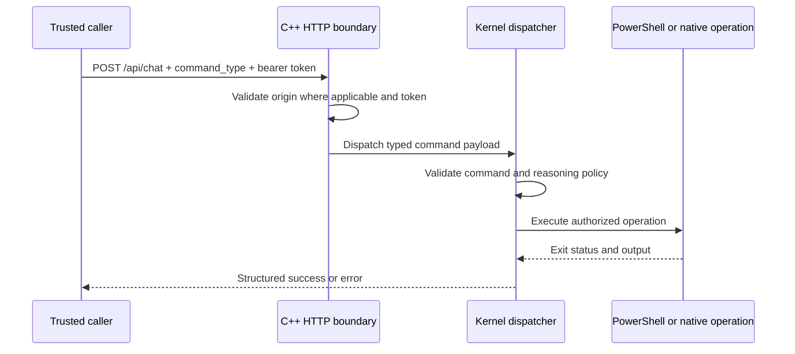

# Runtime: kernel, mouth, Heal, HTTP

Canonical privileged runtime is the C++ kernel on `127.0.0.1:8083`. It serves
Galaxy, retrieves committed Golden Records from the RAG service, talks to the
one GPU mouth on `:8000`, and dispatches authenticated `command_type` requests.

Index: [`ARCHITECTURE.md`](../../ARCHITECTURE.md). Alexandria write/read:
[`alexandria.md`](alexandria.md). Auth and deploy: [`security-and-ops.md`](security-and-ops.md).

## Inference boundary: the mouth

The mouth is a child process, not an in-process library. Galaxy chat prefers an
already-running OpenAI door on `127.0.0.1:8000` (`POST /v1/chat/completions`)
so the model stays resident in VRAM. On this host that is `llama-server` when
`logs/mouth.txt` says llama. Desk default is Gemma 12B Q4 **with MTP**
(`Start-LlamaServer.ps1`; pass `-NoDraft` to start without the draft GGUF).

If `:8000` is down the kernel **refuses** to cold-spawn a 16 GB snapshot. Heal
and Watch start the configured mouth instead. `/api/status` and `/brief` may
kick `Start-LlamaServer.ps1` via `run_hidden` (skip CS2, skip a loading
`llama-server.exe`, 5 min cooldown) and report `llama=starting`.

Librarian and chat share that single GPU slot. Librarian does not hold VRAM; it
POSTs the live mouth. It does not cold-spawn Colibri unless
`GODBRAIN_LIBRARIAN_SPAWN=1`.

The Colibri React web UI (Chat/Brain/Profiling) is an engine workshop. It is
not the GodBrain operator UI and must not be used for RAG, `/observe`, or
judgment.

Do not set both `COLI_GPU` and `COLI_GPUS`. Colibri VRAM budget is derived from
DXGI dedicated memory and does not overcommit into system RAM unless
`GODBRAIN_COLI_OVERCOMMIT=1`.

## Execution boundary: C++ kernel

The C++ kernel is the only HTTP component that exposes the privileged
`command_type` dispatch path. It binds to `127.0.0.1:8083`.

Ordinary local chat and read endpoints remain unauthenticated on loopback. A
request carrying `command_type` additionally requires:

- `Authorization: Bearer <GODBRAIN_API_TOKEN>`
- A configured server-side `GODBRAIN_API_TOKEN`
- A non-empty `reasoning` string for high-risk commands
- A recognized command type

If the token is absent or invalid, the request is rejected with `401` or `403`.
The token is not logged.

The current dispatcher supports:

- `execute_godbrain_script`
- `propose_sovereign_architect_change`
- `save_godbrain_thought` (candidate Golden Record via `memory-store.exe`)
- `query_recent_thoughts` (newest active-generation `rag_documents`)
- `set_godbrain_status` (`verified`, `rejected`, or `stale` with reasoning)
- `get_system_telemetry`
- `observe_godbrain_host` (Windows inventory + `os_pin`; auto-verified sensor)
- `promote_godbrain_claim` (`POST /api/truth`: host_fact / doc_fact / playbook)

The first two can execute arbitrary PowerShell after authorization. This is an
intentional high-risk capability, not a sandbox. `wsudo` or an elevated process
token provides privileged user-mode execution. It does not provide kernel-mode
access.

Ordinary Galaxy chat also accepts `/observe`, `/remember`, `/idea`, `/ideas`,
`/verify`, `/reject`, `/recall`, `/status`, `/last`, `/brief`, `/pending`,
`/heal`, `/sre`, `/vram`, `/edit`, `/last-edit`, and `/doors` without a bearer
token on loopback. These are teach/judgment/glance, not privileged host
execution.

`/observe` writes a stable host inventory (computer name, total RAM, logical
CPU count, fixed volumes with letter/label/total GB, `os_pin=EditionID/CurrentBuild.UBR`)
and auto-verifies that sensor read. Live CPU/RAM and free disk space are shown
and not stored. `/remember` writes only `candidate`. `POST /api/truth`
auto-verifies a `host_fact` when an allowlisted probe matches, or a `doc_fact`
when a Learn/support quote is actually on the page. Playbooks stay `candidate`.
When `os_pin` changes, verified `windows-sre` cards that embed a different
`os_pin=` become `stale`.

Oracle RAG search is `verified` only. `/verify` and `/reject` remain the human
door for playbooks and contradictions. Rejected nodes stay in source
collections but are hidden from default search and the Galaxy graph.
`rejected` is terminal. Content never changes; only status does.

`GET /api/status` `host_record` is the Windows host inventory card (`os_pin=`
present, not a Playbook). It is not "the newest `windows-sre` card."

## HTTP surfaces

### C++ Kernel (`127.0.0.1:8083`)

| Method | Route | Authentication | Purpose |
|---|---|---|---|
| `GET` | `/` | None | Redirect to Galaxy |
| `GET` | `/galaxy` | None | Serve the operator UI |
| `GET` | `/frontend/*` | None | Static frontend assets |
| `GET` | `/api/test` | None | Liveness response |
| `GET` | `/api/graph` | None | Bounded Golden Record graph for Galaxy (`rag_documents`, max 500 nodes) |
| `GET` | `/api/node` | None | Single Golden Record document by `node_id` or `stable_id` |
| `GET` | `/api/status` | None on loopback | Kernel, mouth, VRAM plan, RAG health, last Oracle turn, `pending_items`, host inventory |
| `GET` | `/api/brief` | None on loopback | One-glance host + mouth + pending-judge + heal + CS2-sleep + last-turn; writes `logs/last-brief.txt` |
| `GET` | `/api/heal` | None on loopback | Same text as `/heal` including `age=` minutes since `heal-last.json`; writes `logs/last-heal.txt` |
| `GET` | `/api/sre` | None on loopback | Layer + last `sre_surgeon --diagnose` snapshot (no GPU); writes `logs/last-sre.txt` |
| `GET` | `/api/pending` | None on loopback | Candidate Oracle turns, candidate host card, newest unverified Golden Records (skip `kind=concept` and Heal-loop labels); writes `logs/last-pending.json` |
| `GET` | `/api/last` | None on loopback | On-disk Oracle glance (no mouth call); writes `logs/last-oracle.txt` |
| `GET` | `/api/last-edit` | None on loopback | Last local-edit result (no GPU); writes `logs/last-edit.txt` |
| `GET` | `/api/vram` | None on loopback | One GPU slot + next worker size; writes `logs/last-vram.json` |
| `GET` | `/api/doors` | None on loopback | Loopback and Tailscale URLs; chat stays loopback-only |
| `GET` | `/api/desk` | None on loopback | Desk health used by `Test-GodBrainDesk.ps1` |
| `POST` | `/api/remember` | Bearer if `GODBRAIN_API_TOKEN` is set | Save a candidate idea (Shortcuts / Brave / iPhone) |
| `POST` | `/api/librarian` | Bearer if `GODBRAIN_API_TOKEN` is set | Distill `text` via the live `:8000` mouth; fail-closed if CS2 sleeping, mouth busy, or `:8000` down (may kick Start-LlamaServer; will not stack a second generate) |
| `POST` | `/api/observe` | Bearer if `GODBRAIN_API_TOKEN` is set | Store host inventory (Heal posts this each tick; unchanged is idempotent) |
| `POST` | `/api/truth` | Bearer if `GODBRAIN_API_TOKEN` is set | host_fact / doc_fact / playbook; probes and Learn quotes can promote; playbooks stay candidate |
| `POST` | `/api/judge` | Bearer if `GODBRAIN_API_TOKEN` is set | Set a node `verified` or `rejected` with reasoning; rewrites `logs/last-pending.json` |
| `POST` | `/api/chat` | None for ordinary chat | RAG plus streamed mouth inference; loopback only |
| `POST` | `/api/chat` with `command_type` | Bearer token; reasoning for high-risk commands | Direct privileged kernel dispatch |

The kernel accepts CORS only from exact trusted loopback/Tauri origins. CORS
controls browser access; non-browser callers still require authentication for
privileged commands.

Ordinary chat asks the mouth with `stream: true`. Prefill keepalives and tokens
are forwarded as SSE (`Accept: text/event-stream`). Oracle answers are stored
as candidate Golden Records and in `last_oracle.json` (replace in place).
`/last` replays that log without starting a generate.

`/brief` also prepends `logs/where-we-are.md` when present. If the Tailscale
door is bound, `/brief` prints `tail=door/<100.x>`.

### Tailscale door

When `GODBRAIN_API_TOKEN` is set and the adapter has a 100.x address, a second
listener binds on that IPv4. `/status` late-binds that door if Tailscale logs
in after kernel boot, and reports `needs_login` when the service is up but
offline. Heal does not `tailscale up`.

On that listener every route requires the bearer, including GETs. Exposed:

- GET: `/api/brief`, `/api/vram`, `/api/heal`, `/api/sre`, `/api/status`,
  `/api/last`, `/api/doors`, `/api/desk`, `/api/pending`, `/api/last-edit`
- POST: `/api/remember`, `/api/librarian`, `/api/observe`, `/api/truth`,
  `/api/judge`

Chat generate is **not** on the Tailscale door. Privileged `command_type` and
Galaxy stay on `127.0.0.1`. Without a token the door stays closed.

Loopback `/api/status` and the GET glances stay open for Galaxy.

### Golden Record RAG and alternative routers

RAG HTTP lives in [`alexandria.md`](alexandria.md). Go/Rust `:8082` routers
live in [`research.md`](research.md).

## Runtime flows

### Ordinary chat and RAG

If RAG is down but the kernel process has session notes from `/remember` or
`/observe`, chat still answers from that buffer. Kernel boot hydrates that
buffer from the newest Golden Records so a restart does not forget the host.
If both are empty, the request fails closed. A timed-out mouth child must not
kill unrelated processes.

Galaxy `GET /api/graph` and `GET /api/node` use the same RAG service
(`/v1/graph`, `/v1/document`) and the same fail-closed rule. Named-card chat
(12-char id) uses `GET /v1/document` and does not mint an Oracle turn.

### Observe, remember, and judge

`/verify last <why>` and `/reject last <why>` judge the newest on-disk Oracle
turn. `/verify <12-char prefix> <why>` resolves against the `/pending` list.
A judge also flips `last_oracle.json` when that id is the last Oracle turn.

### Privileged command

Mouth text is not automatically scanned and executed. A trusted caller must
construct a separate authenticated `command_type` request.

## Heal / Watch

Watch-GodBrain (`GodBrainWatch`) only calls `Heal-GodBrain.ps1`. It never
kills a process. Tasks launch `run_hidden` + `pwsh -File` (never a `.cmd`:
`cmd.exe` flashes Windows Terminal). Both allow start on batteries.

Heal v4 records mouth HTTP ready, `rag /health.ready`, inbox waiting, Tailscale
100.x (detect-only), and `cs2_sleep`. Unready RAG is repaired with
`rag-rebuild.exe` (30 min cooldown, never kills rag-service). Oldest
`inbox\*.txt` is Librarian-ingested when the mouth is healthy and not busy; a
failed extract moves to `inbox\failed\` so the next tick does not steal the
GPU. Claims stay candidate.

Each Heal tick POSTs `/api/observe` (idempotent host pin) and refreshes
`logs/last-brief.txt`, `logs/last-pending.json`, and `logs/last-vram.json`
when the kernel is up (no GPU).

`sre_surgeon --diagnose` runs only when the layer is not ok (15 min cooldown)
and writes `logs/last-sre-diagnose.txt`. Heal never `--ask`.

Heal may run `ipconfig /flushdns` once after diagnose (`dns_self` fail,
Dnscache up, `icmp_loopback` up). `ipconfig /release` `/renew`,
`netsh winsock reset`, `netsh int ip reset`, DeviceCleanupCmd, and reboot
need an explicit operator GO, one named tool per GO. Heal does not reboot.
`nic_tcpip` is detect-only.

WMI process start passes `GODBRAIN_API_TOKEN` in the child environment so
Heal/Watch/logon cannot boot a kernel that fail-opens loopback writes. The
token is never written to `*.launch.cmd`.

Logon (`Start-GodBrain.ps1`) posts `/api/observe` once the kernel is
listening and persists GET `/api/sre` → `logs/last-sre.txt`.

## Local file edits

Galaxy can ask the mouth to change a repo file. The kernel saves the plan in
RAM (`logs/last-edit-plan.txt`), does a second GPU pass for `*** APPLY` blocks
(thinking off, spoken-only parse), writes `logs/last-edit-result.json`, and
writes only root `.ps1` / `.cmd` / `.md` or `godbrain_core\` (not build /
vendor / LLM / archive). `local_edit_test` applies a real fixture file offline
(no GPU). Live `/edit` waits if CS2 is sleeping. Never git push from the mouth.

## CS2 pause

`Start-CS2.ps1` / `Start-CS2.cmd`: pause the mouth (coli and `llama-server`)
and `tailscale down` first, launch Steam app 730, wait until `CS2.exe` exits,
wait 5 minutes, then `tailscale up --unattended` and Start-GodBrain. Never
logout, `--reset`, or uninstall Tailscale.

`Watch-Cs2Pause` (task `GodBrainCs2Pause`) is only the backup if CS2 is
started from Steam Play. It runs `cs2_gate.exe` (no console); pwsh starts only
if CS2.exe is up or `logs/cs2-pause.json` is paused. Start/Heal skip the mouth
while CS2 is running or has been gone under 5 minutes.
