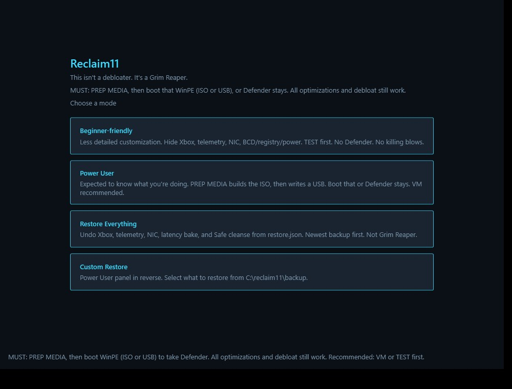
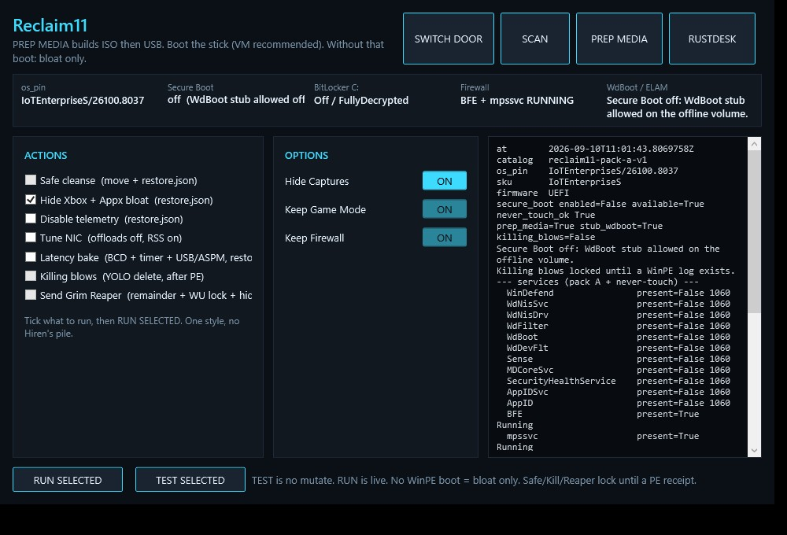

# Reclaim11

**Recommended:** run it on a VM like VMware first, or at least run TEST
mode and see the result.

**MUST:** build a WinPE ISO and boot it if you want Defender / PPL / Sense
gone. That offline pass is the kill. Without that boot, this GUI is
**bloat only** (Xbox, telemetry, NIC). Killing blows and Grim Reaper
stay locked until a WinPE receipt.

## What to do

1. Get `Reclaim11-kit-v9.zip` from
   [GitHub Releases](https://github.com/usrname1git/GodBrain/releases/tag/reclaim11-v9)
   and unzip it. Check the `.sha256` next to the zip.
2. Double-click `Reclaim11.cmd`. You do not type `pwsh`.
3. Click **TEST FIRST** (noob door) or **TEST SELECTED** (expert).
   Nothing is deleted. Read the log.
4. Then pick a door:
   - **Noob:** Hide Xbox + telemetry. No Defender. No killing blows.
   - **Expert:** **PREP MEDIA** builds the WinPE ISO. Attach it in the VM,
     boot it, disconnect, `wpeutil reboot`. After Windows is up, SCAN.
     Killing blows / Grim Reaper unlock only after that boot.

Game Mode stays. The Xbox controller driver stays.





## Advanced

Pack A is Defender / PPL / Sense / AppID. Hide Xbox also clears named
Start junk (Copilot, new Outlook, Clipchamp, …) and turns off Start
Recommended. Photos, Calculator, Store, Notepad stay.

### Rails

- Defender / PPL **require** a WinPE ISO you build and boot. No receipt = bloat only.
- `WdBoot.sys` is ELAM. **Refuse to park/stub it when Secure Boot is on.**
- Killing blows unlock only after a WinPE receipt. Some Windows SKUs are refused.
- WinPE waits **12 seconds**: press **H** if Windows won't boot (skips Automatic Repair). Otherwise pack A runs as today. Help writes `reclaim11-winre-skip.log` and does **not** unlock killing blows.

### Two PE profiles

- **Operator PE:** `reg delete` pack-A service keys in the offline hive
  and **delete** catalog `.sys` (no sidecar `.bak` in `drivers\`).
  Never a usermode EXE over a driver.
- **GUI Safe cleanse:** move-only into `C:\reclaim11\backup\<stamp>\`
  plus `restore.json`. Restore with
  `Restore-Reclaim11Noob.ps1 -Manifest restore.json`. Does not delete.

### WinPE ISO (Defender)

ADK + WinPE addon **10.1.26100.2454**, not ADK 28000.

```text
pwsh -NoProfile -File .\scripts\New-Reclaim11WinPeIso.ps1
```

Output: `C:\Reclaim11\Reclaim11-WinPE-v9.iso`.
v1/v2 copied EXE over `.sys` and bootloop; do not attach those.

Snapshot, attach **v9**. PE **deletes** catalog
`drivers\WdBoot.sys` / `WdFilter.sys` / `WdNisDrv.sys` / `WdDevFlt.sys`
(exact names, never a `Wd*.sys` glob), stubs catalog usermode EXEs,
`reg delete` pack-A keys then Start=4 fallback, IFEO +
`DisableAntiSpyware` in the **offline hives**. Live Windows IFEO is
the wrong door (Tamper/PPL ACL). Disconnect ISO. `wpeutil reboot`.

Secure Boot on: refuse `WdBoot` delete and still boot. Secure Boot off
may drop ELAM.

After reboot, in-Windows `Apply-KillingBlows.ps1` is leftover `sc delete`,
Defender/ExploitGuard scheduled tasks (those two folders only), and delete
of `HKLM\SOFTWARE\Microsoft\Windows Defender` (resurrection lock). GPO
`DisableAntiSpyware=1` stays. Killing blows writes `restore.json` (task XML
under `tasks\`) before the deletes.

Optional remainder: `grim_reaper.ps1` (GUI: Send Grim Reaper). Compat name:
`NuclearDefenderWipe-V6_3.ps1`. v6.3 **deletes** named drivers, never stubs
`.sys` / `.cip`. After 26H1 it also locks WU resurrection
(`wuauserv` / `UsoSvc` / `WaaSMedicSvc` and named task folders) and
hides Windows Update in Settings (`hide:windowsupdate;…`, Game Mode stays).
`pwsh -File grim_reaper.ps1 -SelfTest`.

Physical USB is a **separate** script (ISO builder stays `/ISO` only):

```text
pwsh -NoProfile -File .\scripts\New-Reclaim11WinPeUsb.ps1 -T
pwsh -NoProfile -File .\scripts\New-Reclaim11WinPeUsb.ps1 -DiskNumber N -Go
```

### Hide Xbox, telemetry, NIC

**Hide Xbox** (in-Windows): `restore.json` first, then Settings hide so
Gaming is Game Mode only. Does **not** write `AllowAutoGameMode`.
Does **not** delete `xboxgip`. Does **not** remove
`Microsoft.XboxGameCallableUI`. Admin (UAC). Restore:
`pwsh -File xbox_cleanse.ps1 -Restore restore.json`.

**Disable telemetry:** `AllowTelemetry=0`, `DiagTrack` + `dmwappushservice`
start=disabled. Restore:
`pwsh -File telemetry_cleanse.ps1 -Restore restore.json`.

**Tune NIC** (Ethernet only): EEE/interrupt moderation/flow/WoL off, RSS on,
Rx/Tx **256–512**. Skips VMware host VMnet / Tailscale / Wi-Fi.
`pwsh -File nic_tune.ps1 -T`.

**Latency bake** (Expert, in-Windows, VM-only): BCD `{current}`
`nx AlwaysOff` (DEP off), `tscsyncpolicy Enhanced`,
`hypervisorlaunchtype Auto`, `vsmlaunchtype Off`, `sos No`,
`useplatformclock No`, `useplatformtick No`, `disabledynamictick Yes`;
`{bootmgr}` `bootmenupolicy Legacy`. HKLM
`GlobalTimerResolutionRequests=1`, `SystemResponsiveness=0`,
`Win32PrioritySeparation=38`. `restore.json` first. Desk
(IoTEnterpriseS) refused. WinPE MiniNT refused (that would be the PE
BCD). Not a power scheme. `pwsh -File latency_bake.ps1 -T`. Restore:
`pwsh -File latency_bake.ps1 -Restore restore.json`.

Killing blows / Grim Reaper self-elevate to TrustedInstaller via Task
Scheduler (Admin → SYSTEM → TI). No wsudo / MinSudo. WinPE is already
SYSTEM and skips that hop.

### From this repo

```text
godbrain_core\reclaim11\Reclaim11.cmd
pwsh -NoProfile -File godbrain_core\reclaim11\ps1\Reclaim11.ps1 -T
pwsh -NoProfile -File .\scripts\New-Reclaim11KitZip.ps1
.\scripts\Test-Reclaim11.ps1
```

Headless inventory: `Reclaim11.ps1 -InventoryOnly`. GUI transcripts to
`%LOCALAPPDATA%\Reclaim11\logs`.

BitLocker in the VM is optional; if C: is encrypted, WinPE needs the
protector.

Brave bloat is a **policy overlay** in `brave-policy\`, not a forked browser.
