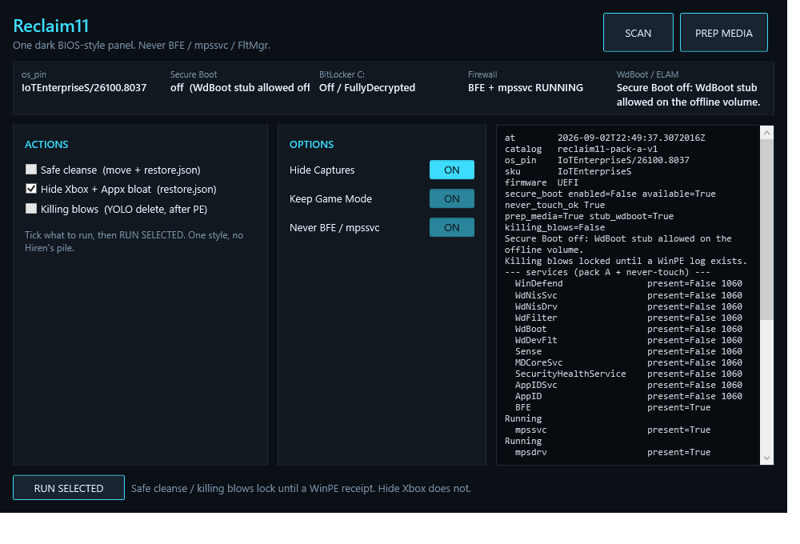

# Reclaim11 (not Heal, not Galaxy)

One WPF window around the pack-A playbook: Defender / PPL / Sense / AppID.
Not `irm | iex`. Not DISM. Never BFE / `mpssvc` /
`FltMgr` / EventLog.

Inventory plus a **WinPE ISO**. Two cleanse profiles:

- **Operator PE:** `reg delete` pack-A service keys in the offline hive
  and **delete** catalog `.sys` (no sidecar `.bak` in `drivers\`).
  Never a usermode EXE over a driver.
- **GUI Safe cleanse:** move-only into `C:\reclaim11\backup\<stamp>\`
  plus `restore.json` (`original` / `backup` / `relative` / `sha256` /
  `length`). Restore with `Restore-Reclaim11Noob.ps1 -Manifest restore.json`.
  Does not delete.

Killing blows (IFEO + `sc delete` pack A) and Safe cleanse run only after
a WinPE receipt, and **refuse this desk** (`IoTEnterpriseS`). Never BFE /
`mpssvc` / `FltMgr`.

## Rails

- Pack A only. Ads/cloud/WU GPO is pack B, later.
- `WdBoot.sys` is ELAM. **Refuse to park/stub it when Secure Boot is on.**
- Killing blows unlock only after a WinPE receipt. Desk SKU is refused.
- Heal never launches this. Kernel YOLO never `--ti` for this.

## Run

```text
pwsh -STA -NoProfile -ExecutionPolicy Bypass -File godbrain_core\reclaim11\Reclaim11.ps1
```

Headless inventory (JSON):

```text
pwsh -NoProfile -File godbrain_core\reclaim11\Reclaim11.ps1 -InventoryOnly
```

GUI (not `-InventoryOnly`) self-elevates UAC, requires FullLanguage, and
transcripts to `%LOCALAPPDATA%\Reclaim11\logs`. ConstrainedLanguage
refuse, `-Verb RunAs`, XAML try/catch, run lock, DragMove, screen clamp,
Esc/Ctrl+Q. `-InventoryOnly` still skips UAC. Not `irm | iex`.

Check:

```text
.\scripts\Test-Reclaim11.ps1
```

## VMware first (this host has Workstation 17.6.4)

Do **not** nuke the desk. Snapshot a VM, then:

1. New Win11 VM, EFI. One snapshot **Secure Boot on**, one **off**.
2. Inventory in the VM (this GUI). Confirm SKU / SB / BitLocker / PPL.
3. Build the ISO (ADK + WinPE addon **10.1.26100.2454**, not ADK 28000):

   ```text
   pwsh -NoProfile -File .\scripts\New-Reclaim11WinPeIso.ps1
   ```

   Output: `C:\nvme\reclaim11\Reclaim11-WinPE-v7.iso` (outside git).
   v1/v2 copied EXE over `.sys` and bootloop; do not attach those.
4. Snapshot, attach **v7**. PE is the kill: **deletes** catalog
   `drivers\WdBoot.sys` / `WdFilter.sys` / `WdNisDrv.sys` / `WdDevFlt.sys`
   (exact names, never a `Wd*.sys` glob), stubs catalog usermode EXEs,
   `reg delete` pack-A keys then Start=4 fallback, IFEO +
   `DisableAntiSpyware` in the **offline hives**. Live Windows IFEO is
   the wrong door (Tamper/PPL ACL). Disconnect ISO. `wpeutil reboot`.
5. SB-on VM must refuse `WdBoot` delete and still boot. SB-off may drop ELAM.
6. After reboot, BFE/`mpssvc` must be RUNNING. In-Windows
   `Apply-KillingBlows.ps1` is leftover `sc delete`, Defender/ExploitGuard
   scheduled tasks (those two folders only), and delete of
   `HKLM\SOFTWARE\Microsoft\Windows Defender` (resurrection lock). GPO
   `DisableAntiSpyware=1` stays. Not a host-wide task glob.
   Optional remainder: `NuclearDefenderWipe-V6_3.ps1` (boot-safe).
   v6.2 stubbed kernel `.sys` and `CIPolicies` and WinRE'd; v6.3
   **deletes** named drivers, never stubs `.sys` / `.cip`, never DENY
   SYSTEM under `System32`. Check: `pwsh -File NuclearDefenderWipe-V6_3.ps1 -SelfTest`.
   Not this desk.

7. Physical USB only after the ISO path is green.

Killing blows also writes `restore.json` (task XML under `tasks\`) before
the deletes. COM CLSID wipe is not pack A (7-Zip / PowerRename stay).

**Disable telemetry** (in-Windows, not PE): `restore.json` first, then
`AllowTelemetry=0`, `DiagTrack` + `dmwappushservice` start=disabled (same
pair the old autom8ed nuke lists used). Not `sc delete`. Not a scheduled-task
glob. Desk SKU refused. Restore:
`pwsh -File telemetry_cleanse.ps1 -Restore restore.json`.

**Hide Xbox** (in-Windows, not PE): writes `C:\reclaim11\backup\<stamp>\restore.json`
first, then machine `SettingsPageVisibility`
`hide:gaming-gamebar;hide:gaming-gamedvr;hide:gaming-trueplay;hide:gaming-broadcasting`
so Settings → Gaming is Game Mode only (Captures hidden; OBS / ShadowPlay / AMD).
HKCU GameBar: `EnableGameBar=0`, startup/broadcast panels off. Does **not** write
`AllowAutoGameMode` / `AutoGameModeEnabled` (Game Mode stays). `sc delete` Xbox
usermode (`XblAuthManager`, `XblGameSave`, `XboxNetApiSvc`, `XboxGipSvc`,
`GamingServices`, `BcastDVRUserService*`). Removes the Appx bloat list
(Game Bar, Bing News, Get Help, Solitaire, Zune, Feedback Hub, Your Phone,
…). Restore: `pwsh -File xbox_cleanse.ps1 -Restore restore.json`. Does
**not** delete `xboxgip` (controller). Does **not** remove
`Microsoft.XboxGameCallableUI`. Desk SKU refused. Hide Xbox is admin
(UAC); killing blows / Nuclear self-elevate to TrustedInstaller via Task
Scheduler (Admin → SYSTEM → TI). No wsudo / MinSudo. WinPE is already
SYSTEM and skips that hop.

GUI (this desk scan, Safe cleanse / Kill locked until a WinPE receipt):



BitLocker in the VM is optional for v1; if C: is encrypted, WinPE needs
the protector and inventory must show it.

Brave bloat is a **policy overlay**, not a forked browser:
`godbrain_core\reclaim11\brave-policy\`. Friend-safe default; download
danger block is an explicit power-user tick with a warning.

## Not in v1

Twitter release, winget store, `sfc` / DISM repair tab, `netsh` reset,
Galaxy, Heal, auto-crown.
